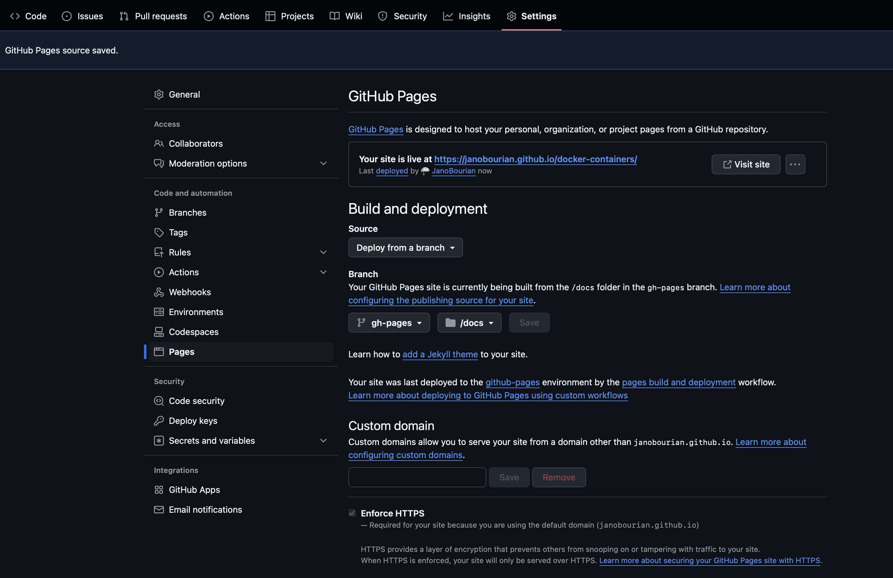

# docker-containers
A repository to learn about Docker containers

## MKDocs

Exist two ways to deploy your documentation, the first way is using a github action pipeline, the other one is using a custom branch.

The first step is to copy this project structure and deploy, and after that you should configure your repository on github like the next image:

