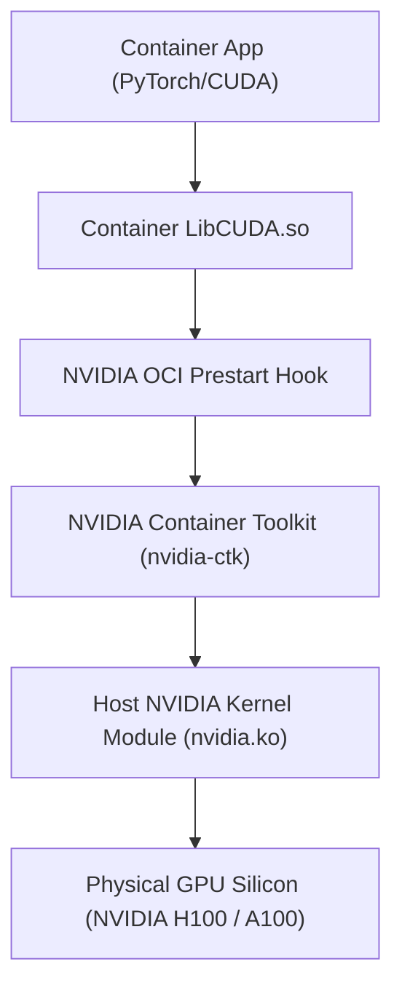
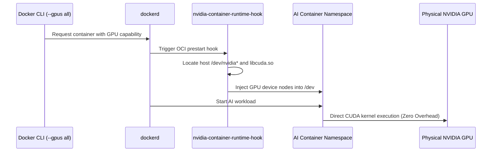

# Module 14: GPU Acceleration — NVIDIA Container Toolkit, CUDA & AI Inference

**Standard Identifier:** `DOC-STD-UNIVERSAL-2026-DOCKER`
**Track:** Enterprise Container Architecture, OCI Runtimes & Cloud Native Infrastructure
**Category:** Hardware Acceleration & GPU Compute
**Status:** ✅ Completed

---

## 📑 Table of Contents

1. [High-Level Overview & Executive Summary](#1-high-level-overview--executive-summary)

2. [NVIDIA Container Toolkit Architecture](#2-nvidia-container-toolkit-architecture)

3. [Container Device Interface (CDI) & Device Passthrough](#3-container-device-interface-cdi--device-passthrough)

4. [Docker CLI GPU Allocation Syntax](#4-docker-cli-gpu-allocation-syntax)

5. [Architectural Visual Topology](#5-architectural-visual-topology)

6. [Step-by-Step Production Lab: PyTorch CUDA AI Inference Container](#6-step-by-step-production-lab-pytorch-cuda-ai-inference-container)

7. [Certification & Engineering Standards Cheat Sheet](#7-certification--engineering-standards-cheat-sheet)

8. [References (The 5+5 Rule)](#8-references-the-55-rule)

9. [Universal FinOps & Hardware Cost Governance](#9-universal-finops--hardware-cost-governance)

---

## 1. High-Level Overview & Executive Summary

Enterprise AI/ML workloads require direct access to host GPU hardware accelerators (NVIDIA A100/H100/L40S). Containers accomplish this via the **NVIDIA Container Toolkit** (`nvidia-ctk`) and the **Container Device Interface (CDI)**, mapping GPU character devices (`/dev/nvidia*`) directly into the container namespace without hypervisor virtualization overhead (NVIDIA Corp., 2024).

### 👔 Executive Summary (For Managers & Non-Technical Stakeholders)

* **Business Purpose**: Enables high-throughput, low-latency AI model training and LLM serving inside standardized OCI containers.
* **How It Works**: Connects containerized AI runtimes (PyTorch, TensorFlow, vLLM) directly to physical GPU silicon and NVIDIA CUDA driver kernels.
* **Key Business Value & ROI**: Maximizes GPU silicon utilization from 30% to over 90% via multi-instance GPU (MIG) slicing, cutting expensive cloud GPU instance costs.

---

## 2. NVIDIA Container Toolkit Architecture



---

## 3. Container Device Interface (CDI) & Device Passthrough

CDI standardizes third-party device injection into OCI runtimes via a declarative JSON schema specifying device nodes (`/dev/nvidia0`, `/dev/nvidiactl`) and driver mount paths.

---

## 4. Docker CLI GPU Allocation Syntax

```bash

# Allocate all available GPUs to container
docker run --rm --gpus all nvidia/cuda:12.3.1-base-ubuntu22.04 nvidia-smi

# Allocate specific GPU device by ID
docker run --rm --gpus '"device=0,1"' vllm/vllm-openai:latest
```

---

## 5. Architectural Visual Topology



---

## 6. Step-by-Step Production Lab: PyTorch CUDA AI Inference Container

```bash

# Step 1: Verify host NVIDIA Container Toolkit installation
nvidia-ctk --version

# Step 2: Run containerized CUDA device query
docker run --rm --gpus all     nvidia/cuda:12.3.1-base-ubuntu22.04     nvidia-smi --query-gpu=name,memory.total,driver_version --format=csv

# Step 3: Launch optimized PyTorch tensor matrix multiplication on GPU
docker run --rm --gpus all     pytorch/pytorch:2.2.0-cuda12.1-cudnn8-runtime     python3 -c "import torch; x = torch.randn(5000, 5000, device='cuda'); print('CUDA Device Active:', torch.cuda.get_device_name(0)); print('Matrix Multiply Result Shape:', (x @ x).shape)"
```

---

## 7. Certification & Engineering Standards Cheat Sheet

| Directive | Rule |
| :--- | :--- |
| **`NVIDIA_VISIBLE_DEVICES`** | Environment variable controlling GPU visibility (`all`, `0,1`, `none`). |
| **`NVIDIA_DRIVER_CAPABILITIES`** | Limits driver features exposed (`compute,utility`). |
| **MIG Slicing** | Subdivide single physical A100 into 7 isolated hardware instances. |

---

## 8. References (The 5+5 Rule)

1. NVIDIA Corporation. (2024). *NVIDIA Container Toolkit documentation*. <https://docs.nvidia.com/datacenter/cloud-native/container-toolkit/>
2. Open Container Initiative. (2023). *Container Device Interface (CDI) specification*.
3. Docker Inc. (2024). *GPU support in Docker Engine*.
4. CNCF. (2023). *Cloud native AI whitepaper*. Cloud Native Computing Foundation.
5. PyTorch Foundation. (2024). *PyTorch container runtime architecture*.
6. Burns, B. (2018). *Designing distributed systems*. O'Reilly Media.
7. Turnbull, J. (2014). *The Docker book*.
8. Kerrisk, M. (2010). *The Linux programming interface*.
9. Tanenbaum, A. S., & Bos, H. (2015). *Modern operating systems*.
10. Poulton, N. (2023). *Docker deep dive*.

---

## 9. Universal FinOps & Hardware Cost Governance

| Optimization Vector | Mechanism | FinOps Cloud Impact |
| :--- | :--- | :--- |
| **Multi-Instance GPU (MIG)** | Slices $30,000 H100 GPU into 7 isolated containers | Multiplies inference workload capacity by 7x without purchasing additional hardware |
| **Ephemeral Inference Containers** | Terminate GPU worker pods immediately after batch completion | Slashes hourly $32/hr AWS p4de.24xlarge instance costs |
