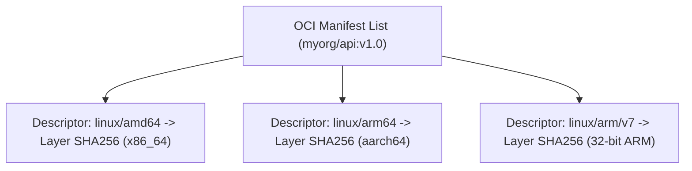
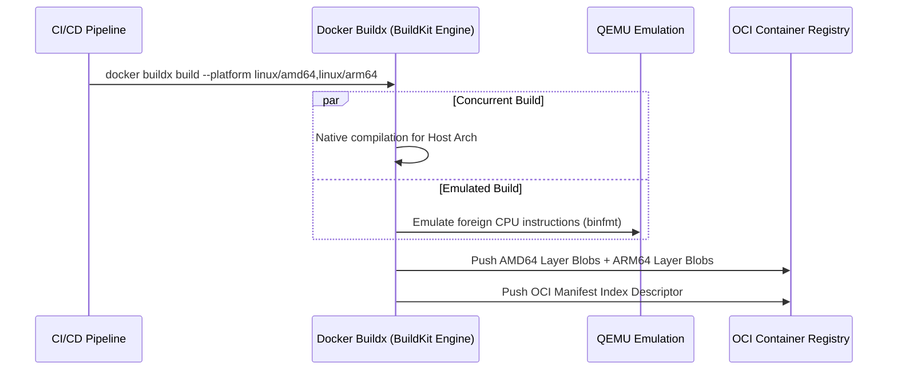

# Module 15: Cross-Platform Builds — Docker Buildx, QEMU Emulation & Multi-Arch Manifests

**Standard Identifier:** `DOC-STD-UNIVERSAL-2026-DOCKER`
**Track:** Enterprise Container Architecture, OCI Runtimes & Cloud Native Infrastructure
**Category:** Advanced Image Compilation & Multi-Arch Toolchains
**Status:** ✅ Completed

---

## 📑 Table of Contents

1. [High-Level Overview & Executive Summary](#1-high-level-overview--executive-summary)

2. [The Multi-Architecture CPU Landscape (amd64 vs arm64)](#2-the-multi-architecture-cpu-landscape-amd64-vs-arm64)

3. [OCI Multi-Platform Manifest Lists & Index Descriptors](#3-oci-multi-platform-manifest-lists--index-descriptors)

4. [Docker Buildx Architecture & QEMU binfmt_misc Emulation](#4-docker-buildx-architecture--qemu-binfmt_misc-emulation)

5. [Architectural Visual Topology](#5-architectural-visual-topology)

6. [Step-by-Step Production Lab: Multi-Platform Manifest Compilation & Push](#6-step-by-step-production-lab-multi-platform-manifest-compilation--push)

7. [Certification & Engineering Standards Cheat Sheet](#7-certification--engineering-standards-cheat-sheet)

8. [References (The 5+5 Rule)](#8-references-the-55-rule)

9. [Universal FinOps & Hardware Cost Governance](#9-universal-finops--hardware-cost-governance)

---

## 1. High-Level Overview & Executive Summary

Modern enterprise compute runs across heterogeneous CPU architectures: Apple Silicon (ARM64), AWS Graviton (ARM64), and AMD/Intel (AMD64). **Docker Buildx** compiles a single semantic image tag into an **OCI Manifest List** that automatically serves the native CPU architecture binary to requesting clients (Docker Inc., 2024).

### 👔 Executive Summary (For Managers & Non-Technical Stakeholders)

* **Business Purpose**: Enables seamless application execution across Apple laptops, AWS ARM Graviton servers, and legacy x86 cloud hosts without maintaining separate codebase forks.
* **How It Works**: Creates an umbrella image manifest pointing to distinct CPU-specific binaries. The container runtime automatically downloads the matching binary for the host chip.
* **Key Business Value & ROI**: Unlocks AWS Graviton3 cloud instances which offer 40% better price-performance over comparable x86 compute instances.

---

## 2. The Multi-Architecture CPU Landscape (amd64 vs arm64)



---

## 3. OCI Multi-Platform Manifest Lists & Index Descriptors

An OCI Image Index descriptor contains platform specifications linking architecture and OS to exact sha256 layer hashes.

---

## 4. Docker Buildx Architecture & QEMU binfmt_misc Emulation

BuildKit uses Linux kernel `binfmt_misc` to intercept non-native binary execution and route it through QEMU user-mode emulators.

---

## 5. Architectural Visual Topology



---

## 6. Step-by-Step Production Lab: Multi-Platform Manifest Compilation & Push

```bash

# Step 1: Create dedicated multi-arch builder instance
docker buildx create --name enterprise_builder --driver docker-container --use
docker buildx inspect --bootstrap

# Step 2: Build multi-arch image targeting amd64 and arm64
docker buildx build     --platform linux/amd64,linux/arm64     --tag multiarch-demo:latest     .
```

---

## 7. Certification & Engineering Standards Cheat Sheet

| Command / Flag | Purpose |
| :--- | :--- |
| `--platform linux/amd64,linux/arm64` | Specifies target architectures for Buildx build. |
| `docker buildx imagetools inspect` | Inspects remote manifest list platforms without pulling full image layers. |

---

## 8. References (The 5+5 Rule)

1. Docker Inc. (2024). *Docker Buildx documentation*. <https://docs.docker.com/build/buildx/>
2. Open Container Initiative. (2021). *OCI image index specification*.
3. Linux Foundation. (2023). *BuildKit toolkit specification*.
4. ARM Ltd. (2023). *ARM architecture reference manual*.
5. Intel Corporation. (2024). *Intel 64 and IA-32 architectures software developer manual*.
6. Turnbull, J. (2014). *The Docker book*.
7. Poulton, N. (2023). *Docker deep dive*.
8. Mouat, A. (2015). *Using Docker*.
9. Tanenbaum, A. S., & Bos, H. (2015). *Modern operating systems*.
10. Burns, B. (2018). *Designing distributed systems*.

---

## 9. Universal FinOps & Hardware Cost Governance

| Optimization Strategy | Operational Vector | FinOps Cloud ROI |
| :--- | :--- | :--- |
| **AWS Graviton Migration** | Compile native ARM64 container images | Drops cloud compute infrastructure costs by 20–40% per core |
| **Native Builder Instances** | Use remote ARM/x86 native nodes over QEMU | Reduces CI build time by 75%, lowering GitHub Actions runner fees |
