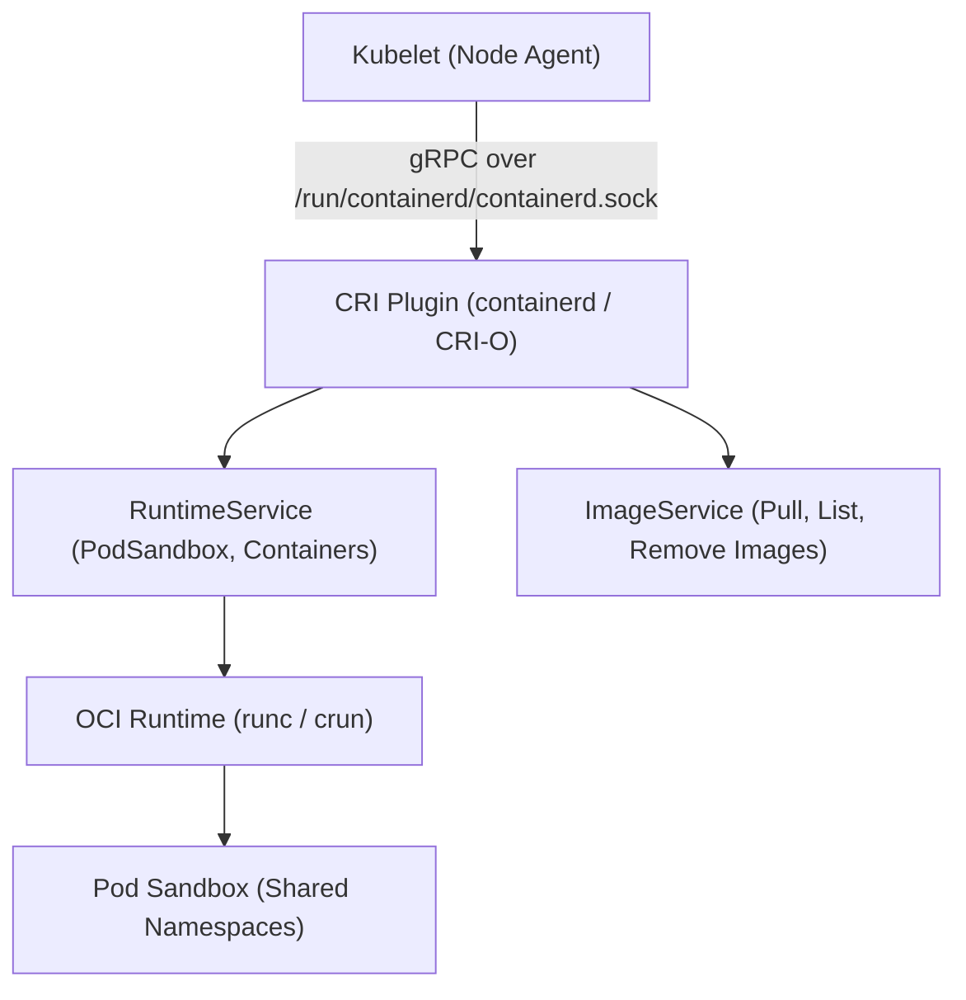
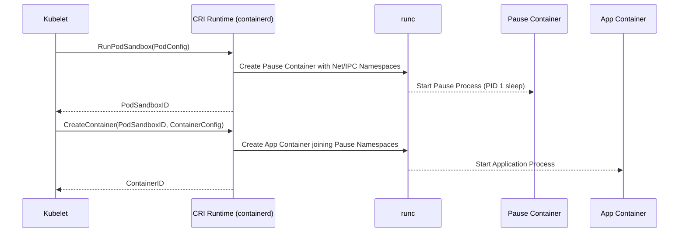

# Module 16: Container Runtime Interface (CRI) — CRI-O, containerd & Pod Sandboxes

**Standard Identifier:** `DOC-STD-UNIVERSAL-2026-DOCKER`
**Track:** Enterprise Container Architecture, OCI Runtimes & Cloud Native Infrastructure
**Category:** Kubernetes Runtimes & CRI Architecture
**Status:** ✅ Completed

---

## 📑 Table of Contents

1. [High-Level Overview & Executive Summary](#1-high-level-overview--executive-summary)

2. [The Kubernetes Container Runtime Interface (CRI) Specification](#2-the-kubernetes-container-runtime-interface-cri-specification)

3. [CRI-O vs containerd: Architectural Comparison](#3-cri-o-vs-containerd-architectural-comparison)

4. [The Pod Sandbox Lifecycle & Pause Container](#4-the-pod-sandbox-lifecycle--pause-container)

5. [Architectural Visual Topology](#5-architectural-visual-topology)

6. [Step-by-Step Production Lab: Direct CRI Interaction via `crictl`](#6-step-by-step-production-lab-direct-cri-interaction-via-crictl)

7. [Certification & Engineering Standards Cheat Sheet](#7-certification--engineering-standards-cheat-sheet)

8. [References (The 5+5 Rule)](#8-references-the-55-rule)

9. [Universal FinOps & Hardware Cost Governance](#9-universal-finops--hardware-cost-governance)

---

## 1. High-Level Overview & Executive Summary

In Kubernetes clusters, the Kubelet node agent delegates container and pod lifecycle operations to dedicated runtimes via the **Container Runtime Interface (CRI)**, a gRPC protocol defining `RuntimeService` and `ImageService` contracts (Kubernetes Authors, 2024).

### 👔 Executive Summary (For Managers & Non-Technical Stakeholders)

* **Business Purpose**: Decouples Kubernetes control plane scheduling from specific container vendor implementations, allowing enterprise clusters to run lightweight, hardened runtimes.
* **How It Works**: Kubelet communicates over gRPC to runtimes like **containerd** or **CRI-O**, which directly manage pod network namespaces and invoke OCI runtimes (`runc`).
* **Key Business Value & ROI**: Eliminates the overhead of legacy monolithic Docker daemons, saving 150MB+ RAM per worker node and improving pod start latency.

---

## 2. The Kubernetes Container Runtime Interface (CRI) Specification



---

## 3. CRI-O vs containerd: Architectural Comparison

| Dimension | `containerd` | `CRI-O` |
| :--- | :--- | :--- |
| **Primary Scope** | General-purpose container runtime (Docker + K8s) | Exclusively purpose-built for Kubernetes CRI |
| **Governance** | CNCF Graduated Project | CNCF Graduated Project |
| **Image Management** | Internal snapshotter / content store | Uses containers/image & containers/storage |
| **Default in Clouds** | EKS, GKE, AKS default | OpenShift default |

---

## 4. The Pod Sandbox Lifecycle & Pause Container

In Kubernetes, a **Pod Sandbox** is created before any application container starts:

1. The runtime creates a dedicated **Pause Container** (`k8s.gcr.io/pause`).
2. The pause container claims the pod's **Network Namespace** (allocating the Pod IP) and **IPC Namespace**.
3. All application containers in the pod join the pause container's namespaces via `setns()`, sharing the same IP address and `localhost` network.

---

## 5. Architectural Visual Topology



---

## 6. Step-by-Step Production Lab: Direct CRI Interaction via `crictl`

```bash

# Step 1: Pull an image via CRI ImageService
crictl pull nginx:alpine

# Step 2: List images managed by CRI
crictl images

# Step 3: Inspect active Pod sandboxes on node
crictl pods
```

---

## 7. Certification & Engineering Standards Cheat Sheet

| Tool / Concept | CKA / CKS Exam Context |
| :--- | :--- |
| **`crictl`** | Kubernetes CLI tool for debugging nodes when Kubelet is down. |
| **`crictl logs <ctr-id>`** | Inspect container logs directly on worker node. |
| **CRI Socket** | `--container-runtime-endpoint=unix:///run/containerd/containerd.sock` |

---

## 8. References (The 5+5 Rule)

1. Kubernetes Authors. (2024). *Container Runtime Interface (CRI) specification*. <https://kubernetes.io/docs/concepts/architecture/cri/>
2. CNCF. (2023). *containerd architecture specification*. <https://containerd.io/>
3. CRI-O Community. (2024). *CRI-O lightweight container runtime for Kubernetes*. <https://cri-o.io/>
4. Open Container Initiative. (2021). *OCI runtime specification*.
5. Hightower, K., Burns, B., & Beda, J. (2022). *Kubernetes: Up and running* (3rd ed.). O'Reilly Media.
6. Burns, B. (2018). *Designing distributed systems*.
7. Turnbull, J. (2014). *The Docker book*.
8. Kerrisk, M. (2010). *The Linux programming interface*.
9. Tanenbaum, A. S., & Bos, H. (2015). *Modern operating systems*.
10. Poulton, N. (2023). *Docker deep dive*.

---

## 9. Universal FinOps & Hardware Cost Governance

| Optimization Strategy | Mechanism | FinOps Cloud Impact |
| :--- | :--- | :--- |
| **Lightweight CRI Runtime** | Replace dockerd with CRI-O/containerd | Saves 150MB RAM per node across 1,000 node cluster (150GB RAM saved) |
| **Direct OCI Invocations** | Eliminate daemon REST API middleware | Reduces pod initialization latency by 30% |
