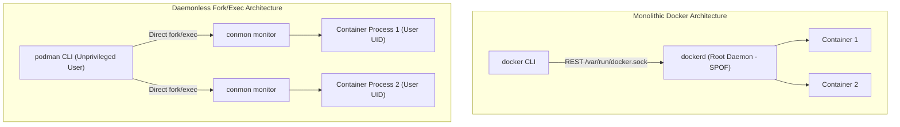
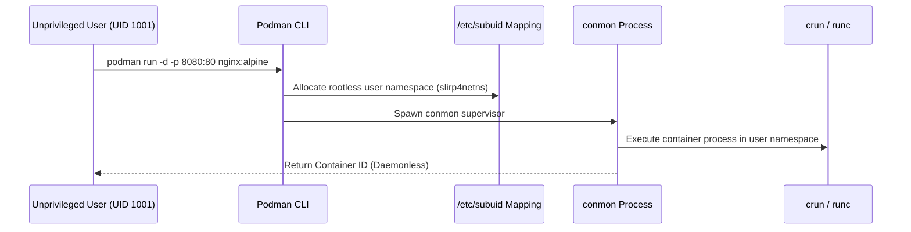

# Module 17: The Daemonless Container Ecosystem — Podman, Buildah & Skopeo

**Standard Identifier:** `DOC-STD-UNIVERSAL-2026-DOCKER`
**Track:** Enterprise Container Architecture, OCI Runtimes & Cloud Native Infrastructure
**Category:** Daemonless & Rootless Container Toolchains
**Status:** ✅ Completed

---

## 📑 Table of Contents

1. [High-Level Overview & Executive Summary](#1-high-level-overview--executive-summary)

2. [The Monolithic Daemon Problem & Single Point of Failure](#2-the-monolithic-daemon-problem--single-point-of-failure)

3. [Podman Architecture: Fork-Exec Model & Systemd Integration](#3-podman-architecture-fork-exec-model--systemd-integration)

4. [Buildah: Fine-Grained OCI Layer Compilation](#4-buildah-fine-grained-oci-layer-compilation)

5. [Skopeo: Remote Registry Inspection & Synchronization](#5-skopeo-remote-registry-inspection--synchronization)

6. [Architectural Visual Topology](#6-architectural-visual-topology)

7. [Step-by-Step Production Lab: Daemonless Rootless Container Pod & Build](#7-step-by-step-production-lab-daemonless-rootless-container-pod--build)

8. [Certification & Engineering Standards Cheat Sheet](#8-certification--engineering-standards-cheat-sheet)

9. [References (The 5+5 Rule)](#9-references-the-55-rule)

10. [Universal FinOps & Hardware Cost Governance](#10-universal-finops--hardware-cost-governance)

---

## 1. High-Level Overview & Executive Summary

Traditional Docker architectures rely on a persistent, privileged background daemon (`dockerd`) running as root. If the daemon crashes, all child containers risk disruption, and root daemon compromise grants full host root access. The **Podman, Buildah, and Skopeo** ecosystem provides a completely **daemonless, rootless fork-exec architecture** where containers run as standard unprivileged Linux user processes (Walsh et al., 2022).

### 👔 Executive Summary (For Managers & Non-Technical Stakeholders)

* **Business Purpose**: Dramatically improves enterprise container security by eliminating root daemon vulnerabilities and aligning with strict zero-trust compliance standards.
* **How It Works**: Breaks monolithic container operations into three specialized UNIX utilities: **Podman** (runs containers and pods), **Buildah** (builds images without a daemon), and **Skopeo** (inspects and moves images across registries).
* **Key Business Value & ROI**: Enables secure multi-tenant developer environments and HPC compute clusters where users cannot be granted root sudo privileges.

---

## 2. The Monolithic Daemon Problem & Single Point of Failure



---

## 3. Podman Architecture: Fork-Exec Model & Systemd Integration

Podman uses **`conmon`** (container monitor) to manage process exit codes, I/O streaming, and systemd cgroup telemetry without any background daemon.

---

## 4. Buildah: Fine-Grained OCI Layer Compilation

Buildah builds OCI images directly from shell scripts without requiring a Docker daemon or Dockerfile:

```bash

# Build image directly via bash
container=$(buildah from alpine:3.19)
buildah run $container apk add --no-cache curl
buildah commit $container my_custom_alpine:latest
```

---

## 5. Skopeo: Remote Registry Inspection & Synchronization

Skopeo inspects remote registry image manifests without downloading layer blobs:

```bash

# Inspect remote image manifest without pulling
skopeo inspect docker://docker.io/library/nginx:alpine
```

---

## 6. Architectural Visual Topology



---

## 7. Step-by-Step Production Lab: Daemonless Rootless Container Pod & Build

```bash

# Step 1: Create a Podman local pod
podman pod create --name web_pod -p 8080:80

# Step 2: Run web container inside the pod
podman run -d --pod web_pod --name web_service nginx:alpine

# Step 3: Verify pod status
podman pod ps

# Step 4: Clean up
podman pod rm -f web_pod
```

---

## 8. Certification & Engineering Standards Cheat Sheet

| Command / Tool | Standard Rule |
| :--- | :--- |
| **`podman generate systemd`** | Creates production systemd service units for containers. |
| **`buildah unshare`** | Enters user namespace with rootless subuid mappings. |

---

## 9. References (The 5+5 Rule)

1. Red Hat. (2024). *Podman documentation and architecture guide*. <https://podman.io/docs/>
2. Walsh, D., & Contributors. (2022). *Podman in action: Secure, rootless, and daemonless container management*. Manning.
3. Open Container Initiative. (2021). *OCI runtime specification*.
4. CNCF. (2023). *Cloud native security whitepaper*.
5. NIST. (2017). *Application container security guide*.
6. Turnbull, J. (2014). *The Docker book*.
7. Kerrisk, M. (2010). *The Linux programming interface*.
8. Poulton, N. (2023). *Docker deep dive*.
9. Tanenbaum, A. S., & Bos, H. (2015). *Modern operating systems*.
10. Burns, B. (2018). *Designing distributed systems*.

---

## 10. Universal FinOps & Hardware Cost Governance

| Optimization Vector | Mechanism | FinOps Cloud Impact |
| :--- | :--- | :--- |
| **Daemonless Idle Nodes** | Zero RAM consumed by idle daemons | Saves 80MB RAM baseline on every developer workstation |
| **Skopeo Layer Mirroring** | Syncs only missing layer blobs | Slashes CI cross-region image replication network bandwidth by 60% |
