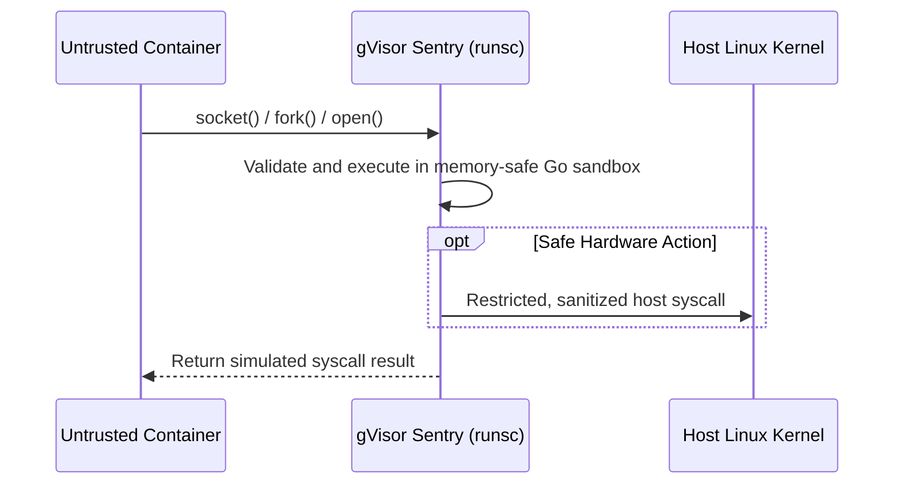

# Module 18: Sandboxed Containers — gVisor (runsc), Kata Containers & MicroVM Isolation

**Standard Identifier:** `DOC-STD-UNIVERSAL-2026-DOCKER`
**Track:** Enterprise Container Architecture, OCI Runtimes & Cloud Native Infrastructure
**Category:** Hardened Sandboxing & MicroVM Hypervisors
**Status:** ✅ Completed

---

## 📑 Table of Contents

1. [High-Level Overview & Executive Summary](#1-high-level-overview--executive-summary)

2. [The Shared Kernel Threat Model & Container Escapes](#2-the-shared-kernel-threat-model--container-escapes)

3. [gVisor (runsc) Architecture: User-Space Kernel Interception](#3-gvisor-runsc-architecture-user-space-kernel-interception)

4. [Kata Containers Architecture: Hardware-Assisted MicroVMs](#4-kata-containers-architecture-hardware-assisted-microvms)

5. [Architectural Visual Topology](#5-architectural-visual-topology)

6. [Step-by-Step Production Lab: Running Sandboxed Workloads with gVisor](#6-step-by-step-production-lab-running-sandboxed-workloads-with-gvisor)

7. [Certification & Engineering Standards Cheat Sheet](#7-certification--engineering-standards-cheat-sheet)

8. [References (The 5+5 Rule)](#8-references-the-55-rule)

9. [Universal FinOps & Hardware Cost Governance](#9-universal-finops--hardware-cost-governance)

---

## 1. High-Level Overview & Executive Summary

Standard OCI containers (`runc`) share the host Linux kernel directly. If a vulnerability exists in the Linux kernel syscall interface (Dirty COW, Dirty Pipe), malicious code inside a container can compromise the host. **Sandboxed Runtimes** eliminate this risk: **gVisor (`runsc`)** intercepts and reimplements Linux syscalls in user space, while **Kata Containers** encapsulates each container in a lightweight hardware-isolated MicroVM (Google LLC, 2024).

### 👔 Executive Summary (For Managers & Non-Technical Stakeholders)

* **Business Purpose**: Guarantees airtight isolation for untrusted third-party code execution, multi-tenant SaaS platforms, and AI code generation sandboxes.
* **How It Works**: Places a security boundary between containerized processes and the host operating system, preventing container breakout attacks.
* **Key Business Value & ROI**: Allows multi-tenant workloads to safely share the same physical server hardware without fear of cross-tenant data leaks.

---

## 2. The Shared Kernel Threat Model & Container Escapes

```mermaid
flowchart TD
    subgraph Standard["Standard runc (Shared Kernel Risk)"]
        App1["Untrusted Code"] -->|Direct Syscalls| HostKernel1["Host Linux Kernel (Vulnerable to 0-days)"]
    end

    subgraph gVisor["gVisor runsc (User-Space Kernel)"]
        App2["Untrusted Code"] -->|Syscalls| Sentry["Sentry (Go-based Kernel)"]
        Sentry -->|Filtered Syscalls| HostKernel2["Host Linux Kernel (Protected)"]
    end

    subgraph Kata["Kata Containers (MicroVM)"]
        App3["Untrusted Code"] --> GuestKernel["Guest Linux Kernel"]
        GuestKernel --> QEMU["MicroVM (QEMU / Cloud-Hypervisor)"]
        QEMU --> HostKernel3["Host Kernel & KVM"]
    end
```



---

## 3. gVisor (runsc) Architecture: User-Space Kernel Interception

gVisor consists of **Sentry** (an application kernel written in memory-safe Go that implements the Linux syscall table) and **Gofer** (a secure file proxy).

---

## 4. Kata Containers Architecture: Hardware-Assisted MicroVMs

Kata Containers uses hardware virtualization extensions (Intel VT-x, AMD-V) to boot an ultra-minimal Linux kernel in less than 100 milliseconds.

---

## 5. Architectural Visual Topology



---

## 6. Step-by-Step Production Lab: Running Sandboxed Workloads with gVisor

```bash

# Step 1: Configure Docker daemon to register runsc runtime

# In /etc/docker/daemon.json:

# {"runtimes": {"runsc": {"path": "/usr/local/bin/runsc"}}}

# Step 2: Run untrusted workload with gVisor runtime
docker run --rm --runtime=runsc alpine:latest dmesg
```

---

## 7. Certification & Engineering Standards Cheat Sheet

| Runtime | Isolation Level | Latency Overhead |
| :--- | :--- | :--- |
| **`runc`** | Namespace / cgroup | Near-zero (Native) |
| **`runsc` (gVisor)** | User-space kernel | Low-medium (Syscall interception) |
| **`kata`** | Hardware MicroVM | Medium (KVM Hypervisor) |

---

## 8. References (The 5+5 Rule)

1. Google LLC. (2024). *gVisor architecture and security model*. <https://gvisor.dev/docs/>
2. OpenStack Foundation. (2024). *Kata Containers: Fast, simple, secure container runtime*. <https://katacontainers.io/>
3. Open Container Initiative. (2021). *OCI runtime specification*.
4. NIST. (2017). *Application container security guide (NIST SP 800-190)*.
5. CNCF. (2023). *Cloud native security whitepaper*.
6. Turnbull, J. (2014). *The Docker book*.
7. Kerrisk, M. (2010). *The Linux programming interface*.
8. Poulton, N. (2023). *Docker deep dive*.
9. Tanenbaum, A. S., & Bos, H. (2015). *Modern operating systems*.
10. Burns, B. (2018). *Designing distributed systems*.

---

## 9. Universal FinOps & Hardware Cost Governance

| Optimization Strategy | Mechanism | FinOps Cloud Impact |
| :--- | :--- | :--- |
| **gVisor Multi-Tenancy** | Runs untrusted client code on shared clusters | Slashes dedicated EC2 VM provisioning costs by 70% |
| **MicroVM Fast Boot** | Sub-100ms cold boot vs 2-minute VM boot | Enables on-demand Serverless Functions with zero idle billing |
