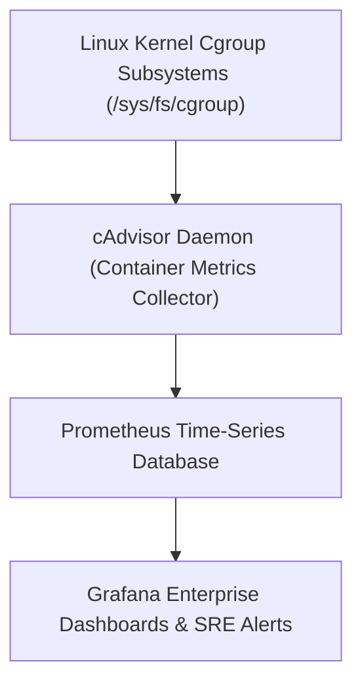
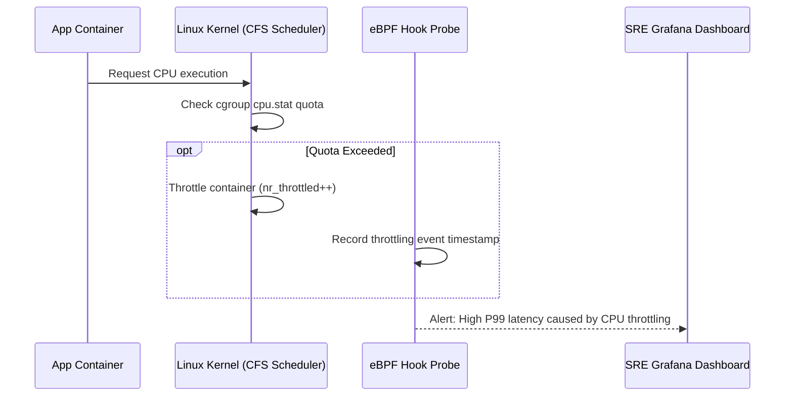

# Module 19: Container Profiling — Linux perf, eBPF Tracing & cAdvisor Metrics

**Standard Identifier:** `DOC-STD-UNIVERSAL-2026-DOCKER`
**Track:** Enterprise Container Architecture, OCI Runtimes & Cloud Native Infrastructure
**Category:** Observability, Profiling & Kernel Tracing
**Status:** ✅ Completed

---

## 📑 Table of Contents

1. [High-Level Overview & Executive Summary](#1-high-level-overview--executive-summary)

2. [Kernel Cgroup Metrics & cAdvisor Architecture](#2-kernel-cgroup-metrics--cadvisor-architecture)

3. [Detecting CPU Throttling in CFS Quota Buffers](#3-detecting-cpu-throttling-in-cfs-quota-buffers)

4. [Profiling Container Syscalls with eBPF and bpftrace](#4-profiling-container-syscalls-with-ebpf-and-bpftrace)

5. [Architectural Visual Topology](#5-architectural-visual-topology)

6. [Step-by-Step Production Lab: cAdvisor Real-Time Prometheus Pipeline](#6-step-by-step-production-lab-cadvisor-real-time-prometheus-pipeline)

7. [Certification & Engineering Standards Cheat Sheet](#7-certification--engineering-standards-cheat-sheet)

8. [References (The 5+5 Rule)](#8-references-the-55-rule)

9. [Universal FinOps & Hardware Cost Governance](#9-universal-finops--hardware-cost-governance)

---

## 1. High-Level Overview & Executive Summary

Profiling containerized microservices requires measuring hardware counter metrics (cycles, instructions, cache misses) and kernel subsystem activity across distinct cgroup hierarchies without injecting intrusive instrumentation into the application container (Gregg, 2020).

### 👔 Executive Summary (For Managers & Non-Technical Stakeholders)

* **Business Purpose**: Uncovers hidden performance bottlenecks, CPU throttling slowdowns, and memory leaks across thousands of production containers.
* **How It Works**: Leverages modern Linux **eBPF** kernel hooks and **cAdvisor** telemetry collectors to capture microsecond-level performance data non-intrusively.
* **Key Business Value & ROI**: Eliminates silent CPU throttling that causes 500ms API latency spikes, ensuring 99.99% enterprise SLA compliance.

---

## 2. Kernel Cgroup Metrics & cAdvisor Architecture



---

## 3. Detecting CPU Throttling in CFS Quota Buffers

When a container exhausts its allocated `cpu.max` quota in a 100ms CFS period, the kernel freezes its threads until the next period, causing dramatic latency spikes.

---

## 4. Profiling Container Syscalls with eBPF and bpftrace

```bash

# Trace container filesystem read latency via eBPF
sudo bpftrace -e 'kprobe:vfs_read { @start[tid] = nsecs; } kretprobe:vfs_read /@start[tid]/ { @latency = hist(nsecs - @start[tid]); delete(@start[tid]); }'
```

---

## 5. Architectural Visual Topology



---

## 6. Step-by-Step Production Lab: cAdvisor Real-Time Prometheus Pipeline

```bash

# Step 1: Run Google cAdvisor container
docker run -d     --name=cadvisor     --privileged     --device=/dev/kmsg     --volume=/:/rootfs:ro     --volume=/var/run:/var/run:ro     --volume=/sys:/sys:ro     --volume=/var/lib/docker/:/var/lib/docker:ro     --volume=/dev/disk/:/dev/disk:ro     --publish=8085:8080     gcr.io/cadvisor/cadvisor:v0.47.2

# Step 2: Query cAdvisor Prometheus metrics endpoint
curl -s http://localhost:8085/metrics | grep "container_cpu_usage_seconds_total" | head -n 5

# Step 3: Clean up
docker stop cadvisor && docker rm cadvisor
```

---

## 7. Certification & Engineering Standards Cheat Sheet

| Metric | Meaning | Alert Threshold |
| :--- | :--- | :--- |
| `container_cpu_cfs_throttled_periods_total` | Number of times process was paused | > 5% of total periods |
| `container_memory_working_set_bytes` | Real memory usage (triggers OOM-killer) | > 85% of memory limit |

---

## 8. References (The 5+5 Rule)

1. Gregg, B. (2020). *Systems performance: Enterprise and the cloud* (2nd ed.). Addison-Wesley.
2. Gregg, B. (2019). *BPF performance tools: Linux system and application observability*. Addison-Wesley.
3. Google LLC. (2024). *cAdvisor: Container Advisor reference*. <https://github.com/google/cadvisor>
4. Prometheus Authors. (2024). *Prometheus monitoring guide*. CNCF.
5. Kerrisk, M. (2010). *The Linux programming interface*.
6. Turnbull, J. (2014). *The Docker book*.
7. Poulton, N. (2023). *Docker deep dive*.
8. Tanenbaum, A. S., & Bos, H. (2015). *Modern operating systems*.
9. Burns, B. (2018). *Designing distributed systems*.
10. Mouat, A. (2015). *Using Docker*.

---

## 9. Universal FinOps & Hardware Cost Governance

| Optimization Technique | Mechanism | FinOps Impact |
| :--- | :--- | :--- |
| **Right-Sizing Memory Limits** | Measure `container_memory_working_set_bytes` | Reduces RAM over-provisioning by 40% across clusters |
| **CFS Quota Tuning** | Optimize CPU quota periods (100ms -> 20ms) | Lowers tail latency without paying for additional vCPU cores |
