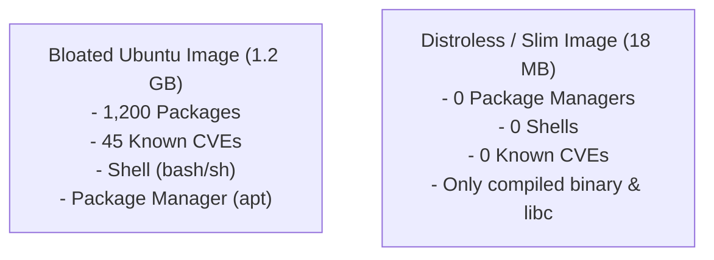
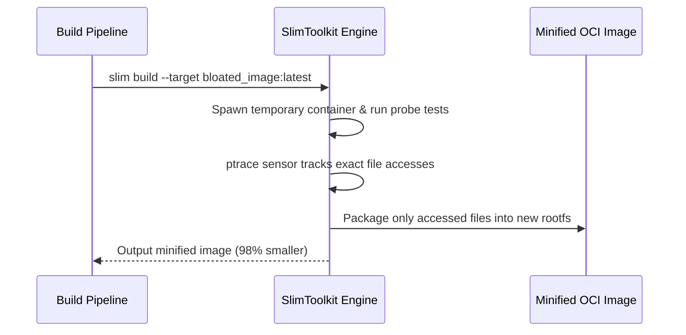

# Module 20: Image Optimization — DockerSlim, Distroless & Minimal Root Filesystems

**Standard Identifier:** `DOC-STD-UNIVERSAL-2026-DOCKER`
**Track:** Enterprise Container Architecture, OCI Runtimes & Cloud Native Infrastructure
**Category:** Container Minification & Attack Surface Reduction
**Status:** ✅ Completed

---

## 📑 Table of Contents

1. [High-Level Overview & Executive Summary](#1-high-level-overview--executive-summary)

2. [The Attack Surface of Bloated Container Images](#2-the-attack-surface-of-bloated-container-images)

3. [Google Distroless Images & Scratch Base Images](#3-google-distroless-images--scratch-base-images)

4. [DockerSlim / SlimToolkit Dynamic Minification Architecture](#4-dockerslim--slimtoolkit-dynamic-minification-architecture)

5. [Architectural Visual Topology](#5-architectural-visual-topology)

6. [Step-by-Step Production Lab: Minifying a 1.2GB Image to 18MB](#6-step-by-step-production-lab-minifying-a-12gb-image-to-18mb)

7. [Certification & Engineering Standards Cheat Sheet](#7-certification--engineering-standards-cheat-sheet)

8. [References (The 5+5 Rule)](#8-references-the-55-rule)

9. [Universal FinOps & Hardware Cost Governance](#9-universal-finops--hardware-cost-governance)

---

## 1. High-Level Overview & Executive Summary

Standard application container images often bundle full operating system toolchains (package managers, shells, debuggers, compilers) resulting in multi-gigabyte image sizes and thousands of unpatched CVE vulnerabilities. Image optimization architectures employ **Google Distroless** and **DockerSlim** to strip away all unnecessary binaries, producing ultra-compact, hardened production containers (SlimToolkit Community, 2024).

### 👔 Executive Summary (For Managers & Non-Technical Stakeholders)

* **Business Purpose**: Shrinks container image footprint by up to 98% and eliminates 90%+ of static security vulnerabilities.
* **How It Works**: Dynamically analyzes the container at runtime to discover the exact binaries and system libraries needed, discarding everything else (including shells and package managers).
* **Key Business Value & ROI**: Slashes container image download times during auto-scaling events from 45 seconds to 1 second, preventing website downtime during traffic spikes.

---

## 2. The Attack Surface of Bloated Container Images



---

## 3. Google Distroless Images & Scratch Base Images

* **`scratch`**: An empty, zero-byte base image for pure statically compiled binaries (Go, Rust, C).
* **`gcr.io/distroless/static`**: Contains only CA certificates, `/etc/passwd` for non-root users, and timezone data.
* **`gcr.io/distroless/nodejs`**: Minimal Node.js runtime without bash or npm.

---

## 4. DockerSlim / SlimToolkit Dynamic Minification Architecture

DockerSlim performs static Dockerfile inspection followed by dynamic execution tracing using `ptrace` and Fanotify to log every file, library, and syscall touched during runtime.

---

## 5. Architectural Visual Topology



---

## 6. Step-by-Step Production Lab: Minifying a 1.2GB Image to 18MB

```bash

# Step 1: Inspect image footprint
docker pull golang:1.22-alpine

# Step 2: Build ultra-minimal Go binary on scratch
mkdir -p /tmp/scratch_lab && cd /tmp/scratch_lab
cat << 'EOF' > main.go
package main
import (
    "fmt"
    "net/http"
)
func main() {
    http.HandleFunc("/", func(w http.ResponseWriter, r *http.Request) {
        fmt.Fprintf(w, "🚀 Ultra-Slim Container Active!")
    })
    http.ListenAndServe(":8080", nil)
}
EOF

cat << 'EOF' > Dockerfile
FROM golang:1.22-alpine AS builder
WORKDIR /src
COPY main.go .
RUN CGO_ENABLED=0 go build -ldflags="-s -w" -o /app/server main.go

FROM scratch
COPY --from=builder /app/server /server
EXPOSE 8080
ENTRYPOINT ["/server"]
EOF

# Step 3: Build image and inspect size (< 10MB!)
docker build -t micro-go:latest .
docker image ls micro-go:latest
```

---

## 7. Certification & Engineering Standards Cheat Sheet

| Optimization Standard | Best Practice Rule |
| :--- | :--- |
| **No Shell in Prod** | Prevents reverse shell execution if attacker achieves remote code execution. |
| **`-ldflags="-s -w"`** | Strips debug symbols and DWARF tables from Go/C binaries. |

---

## 8. References (The 5+5 Rule)

1. Google LLC. (2024). *Distroless container images*. <https://github.com/GoogleContainerTools/distroless>
2. SlimToolkit Community. (2024). *SlimToolkit documentation*. <https://github.com/slimtoolkit/slim>
3. Open Container Initiative. (2021). *OCI image specification*.
4. NIST. (2017). *Application container security guide*.
5. CNCF. (2023). *Cloud native security whitepaper*.
6. Turnbull, J. (2014). *The Docker book*.
7. Poulton, N. (2023). *Docker deep dive*.
8. Kerrisk, M. (2010). *The Linux programming interface*.
9. Tanenbaum, A. S., & Bos, H. (2015). *Modern operating systems*.
10. Burns, B. (2018). *Designing distributed systems*.

---

## 9. Universal FinOps & Hardware Cost Governance

| Optimization Strategy | Operational Mechanism | FinOps Cloud Impact |
| :--- | :--- | :--- |
| **Distroless Minification** | Shrinks images from 1GB to 20MB | Slashes cloud container registry storage bills by 95% |
| **Instant Pod Pulls** | Download 20MB layers in 0.5 seconds | Enables instant autoscaling with zero over-provisioned standby nodes |
