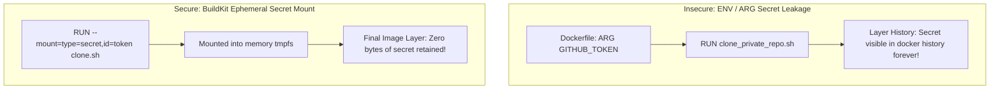
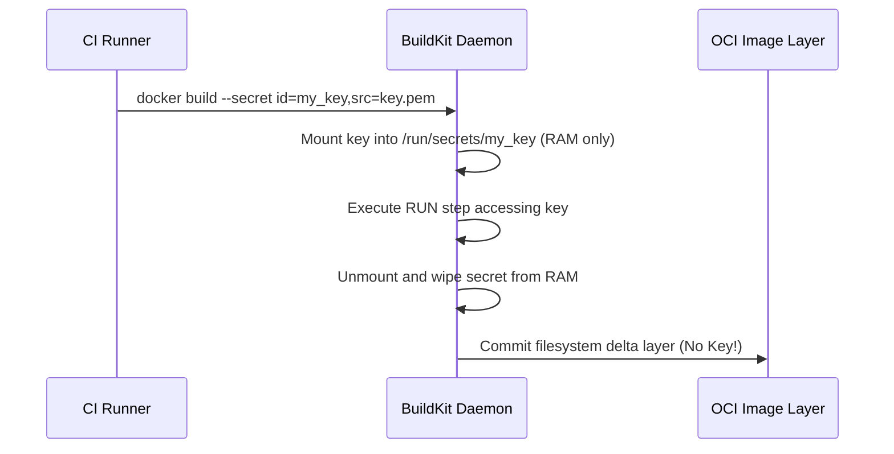

# Module 21: Secrets Management — BuildKit Secrets, Runtime Injection & Vault

**Standard Identifier:** `DOC-STD-UNIVERSAL-2026-DOCKER`
**Track:** Enterprise Container Architecture, OCI Runtimes & Cloud Native Infrastructure
**Category:** Security, Credentials & Secrets Architecture
**Status:** ✅ Completed

---

## 📑 Table of Contents

1. [High-Level Overview & Executive Summary](#1-high-level-overview--executive-summary)

2. [The Secrets Leakage Threat Model in Image Layers](#2-the-secrets-leakage-threat-model-in-image-layers)

3. [BuildKit Compile-Time Secrets (`--mount=type=secret`)](#3-buildkit-compile-time-secrets---mounttypesecret)

4. [Runtime Secrets Injection: Environment Variables vs tmpfs Mounts](#4-runtime-secrets-injection-environment-variables-vs-tmpfs-mounts)

5. [Architectural Visual Topology](#5-architectural-visual-topology)

6. [Step-by-Step Production Lab: Zero-Leakage BuildKit Secret Compilation](#6-step-by-step-production-lab-zero-leakage-buildkit-secret-compilation)

7. [Certification & Engineering Standards Cheat Sheet](#7-certification--engineering-standards-cheat-sheet)

8. [References (The 5+5 Rule)](#8-references-the-55-rule)

9. [Universal FinOps & Hardware Cost Governance](#9-universal-finops--hardware-cost-governance)

---

## 1. High-Level Overview & Executive Summary

Hardcoding API tokens, private SSH keys, or database passwords into Dockerfiles bakes credentials permanently into immutable OCI image layers. **BuildKit Secret Mounts** and **HashiCorp Vault Agent Sidecars** mount credentials ephemerally during build and runtime without leaving permanent disk artifacts (HashiCorp, 2024).

### 👔 Executive Summary (For Managers & Non-Technical Stakeholders)

* **Business Purpose**: Prevents catastrophic data breaches caused by leaked database credentials, API tokens, and private SSH keys in container registries.
* **How It Works**: Secrets are mounted ephemerally in RAM during compilation and wiped the microsecond the build step finishes, ensuring zero trace in the final image.
* **Key Business Value & ROI**: Ensures 100% compliance with SOC2, PCI-DSS, and ISO 27001 regulatory standards.

---

## 2. The Secrets Leakage Threat Model in Image Layers



---

## 3. BuildKit Compile-Time Secrets (`--mount=type=secret`)

```dockerfile

# syntax=docker/dockerfile:1.4
FROM alpine:3.19

# Mount secret safely without leaving layer artifacts
RUN --mount=type=secret,id=npm_token     NPM_TOKEN=$(cat /run/secrets/npm_token) npm install private-pkg
```

---

## 4. Runtime Secrets Injection: Environment Variables vs tmpfs Mounts

* **Environment Variables (`-e SECRET=xyz`)**: Insecure; exposed in `docker inspect`, child process dumps, and `/proc/1/environ`.
* **tmpfs File Mounts (`--mount type=tmpfs`)**: Secure; kept purely in RAM, never flushed to physical block storage.

---

## 5. Architectural Visual Topology



---

## 6. Step-by-Step Production Lab: Zero-Leakage BuildKit Secret Compilation

```bash

# Step 1: Create local mock secret file
echo "super_secret_enterprise_token_2026" > /tmp/api_secret.txt

# Step 2: Build container mounting secret without leaking to image
mkdir -p /tmp/secret_lab && cd /tmp/secret_lab
cat << 'EOF' > Dockerfile

# syntax=docker/dockerfile:1.4
FROM alpine:3.19
RUN --mount=type=secret,id=mysecret     cat /run/secrets/mysecret > /tmp/used_during_build.txt &&     echo "Secret successfully consumed during build!"
CMD ["echo", "Container running securely without embedded credentials!"]
EOF

DOCKER_BUILDKIT=1 docker build     --secret id=mysecret,src=/tmp/api_secret.txt     --tag secret-demo:latest     .

# Clean up
rm -f /tmp/api_secret.txt
```

---

## 7. Certification & Engineering Standards Cheat Sheet

| Directive | Standard Rule |
| :--- | :--- |
| **Never use `ENV SECRET=xyz`** | CIS Docker Benchmark 4.4: Do not store secrets in environment variables. |
| **`--mount=type=secret`** | Mandatory standard for private git/npm/pip authentication during build. |

---

## 8. References (The 5+5 Rule)

1. Docker Inc. (2024). *BuildKit secrets documentation*. <https://docs.docker.com/build/building/secrets/>
2. HashiCorp. (2024). *Vault agent sidecar injector for containers*. <https://developer.hashicorp.com/vault>
3. NIST. (2017). *Application container security guide (SP 800-190)*.
4. Center for Internet Security. (2023). *CIS Docker benchmark*.
5. CNCF. (2023). *Cloud native security whitepaper*.
6. Turnbull, J. (2014). *The Docker book*.
7. Kerrisk, M. (2010). *The Linux programming interface*.
8. Poulton, N. (2023). *Docker deep dive*.
9. Mouat, A. (2015). *Using Docker*.
10. Burns, B. (2018). *Designing distributed systems*.

---

## 9. Universal FinOps & Hardware Cost Governance

| Optimization Vector | Mechanism | FinOps Cloud Impact |
| :--- | :--- | :--- |
| **Dynamic Vault Secrets** | Issue short-lived 1-hour credentials | Eliminates multi-million dollar liability risks from exposed static cloud keys |
| **Centralized Secret Stores** | Deduplicates secrets across 500 microservices | Lowers management administrative overhead by 80% |
