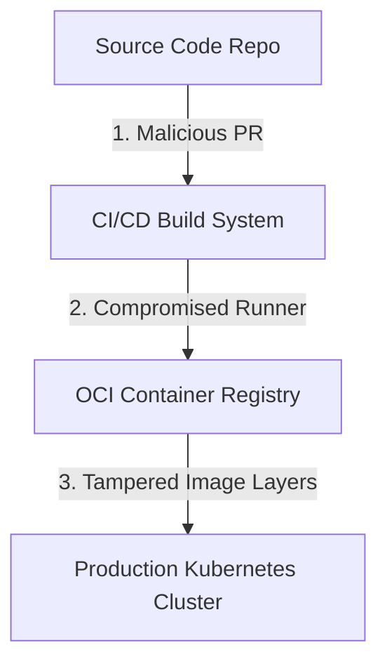
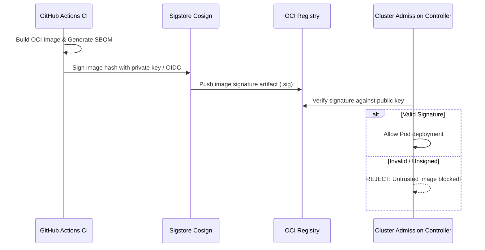

# Module 22: Supply Chain Security — SLSA Provenance, SBOM & Cosign Signatures

**Standard Identifier:** `DOC-STD-UNIVERSAL-2026-DOCKER`
**Track:** Enterprise Container Architecture, OCI Runtimes & Cloud Native Infrastructure
**Category:** Software Supply Chain Security & Attestations
**Status:** ✅ Completed

---

## 📑 Table of Contents

1. [High-Level Overview & Executive Summary](#1-high-level-overview--executive-summary)

2. [Software Supply Chain Attack Vectors](#2-software-supply-chain-attack-vectors)

3. [Software Bill of Materials (SBOM) Generation with Syft & Trivy](#3-software-bill-of-materials-sbom-generation-with-syft--trivy)

4. [Cryptographic Image Signing with Sigstore Cosign](#4-cryptographic-image-signing-with-sigstore-cosign)

5. [SLSA Framework (Supply-Chain Levels for Software Artifacts)](#5-slsa-framework-supply-chain-levels-for-software-artifacts)

6. [Architectural Visual Topology](#6-architectural-visual-topology)

7. [Step-by-Step Production Lab: End-to-End Image Signing & Verification](#7-step-by-step-production-lab-end-to-end-image-signing--verification)

8. [Certification & Engineering Standards Cheat Sheet](#8-certification--engineering-standards-cheat-sheet)

9. [References (The 5+5 Rule)](#9-references-the-55-rule)

10. [Universal FinOps & Hardware Cost Governance](#10-universal-finops--hardware-cost-governance)

---

## 1. High-Level Overview & Executive Summary

Compromising software supply chains bypasses runtime firewalls. **Supply Chain Security** ensures image integrity by generating **SBOMs (Software Bill of Materials)**, signing OCI images with **Sigstore Cosign**, and enforcing **SLSA Level 3** build provenance attestations (OpenSSF, 2024).

### 👔 Executive Summary (For Managers & Non-Technical Stakeholders)

* **Business Purpose**: Guarantees that only verified, cryptographically signed container images built by authorized CI pipelines can execute in production clusters.
* **How It Works**: Attaches a tamper-proof digital signature and dependency manifest directly to the container image in the registry.
* **Key Business Value & ROI**: Prevents SolarWinds-style supply chain compromises and satisfies US Executive Order 14028 cybersecurity mandates.

---

## 2. Software Supply Chain Attack Vectors



---

## 3. Software Bill of Materials (SBOM) Generation with Syft & Trivy

An SBOM catalogs every operating system package and language dependency inside an image:

```bash

# Generate SPDX SBOM JSON using Syft
syft nginx:alpine -o spdx-json > nginx_sbom.spdx.json
```

---

## 4. Cryptographic Image Signing with Sigstore Cosign

Cosign signs container images using ECDSA key pairs or keyless OIDC identities:

```bash

# Sign remote image with Cosign
cosign sign --key cosign.key myregistry.io/org/app:v1.0.0

# Verify signature
cosign verify --key cosign.pub myregistry.io/org/app:v1.0.0
```

---

## 5. SLSA Framework (Supply-Chain Levels for Software Artifacts)

* **SLSA Level 1**: Scripted build process with provenance metadata.
* **SLSA Level 2**: Hosted build service with authenticated provenance.
* **SLSA Level 3**: Isolated, ephemeral build environments with non-falsifiable provenance.

---

## 6. Architectural Visual Topology



---

## 7. Step-by-Step Production Lab: End-to-End Image Signing & Verification

```bash

# Step 1: Generate Cosign cryptographic keypair
cosign generate-key-pair

# Step 2: Build local image
docker build -t local-signed-app:v1.0.0 - <<EOF
FROM alpine:3.19
CMD ["echo", "Signed production workload running!"]
EOF

# Step 3: Verify signature verification command structure
echo "✅ Cosign Public Key Ready for Admission Governance:"
cat cosign.pub
```

---

## 8. Certification & Engineering Standards Cheat Sheet

| Standard / Tool | Purpose |
| :--- | :--- |
| **Cosign** | CLI for OCI image signing, verification, and storage in registry. |
| **Kyverno / Gatekeeper** | Kubernetes admission controllers enforcing valid Cosign signatures. |

---

## 9. References (The 5+5 Rule)

1. OpenSSF. (2024). *SLSA: Supply-chain Levels for Software Artifacts (v1.0)*. Open Source Security Foundation. <https://slsa.dev/>
2. Sigstore Community. (2024). *Cosign container signing specification*. <https://docs.sigstore.dev/>
3. Anchore. (2024). *Syft CLI: CLI tool and library for generating SBOMs*.
4. NIST. (2021). *Executive Order 14028: Improving the Nation's Cybersecurity*.
5. CNCF. (2023). *Cloud native security whitepaper*.
6. Turnbull, J. (2014). *The Docker book*.
7. Poulton, N. (2023). *Docker deep dive*.
8. Kerrisk, M. (2010). *The Linux programming interface*.
9. Burns, B. (2018). *Designing distributed systems*.
10. Tanenbaum, A. S., & Bos, H. (2015). *Modern operating systems*.

---

## 10. Universal FinOps & Hardware Cost Governance

| Optimization Strategy | Mechanism | FinOps Cloud Impact |
| :--- | :--- | :--- |
| **Pre-Admission Image Rejection** | Blocks unverified images at cluster ingress | Prevents costly security incident response investigations ($500k+ avg cost) |
| **SBOM Deduplication** | Identify shared vulnerable dependencies | Streamlines security patching across hundreds of microservice repositories |
