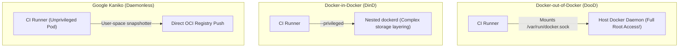
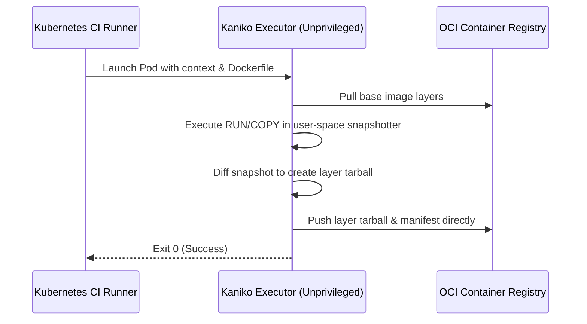

# Module 23: CI/CD Pipeline Integration — Docker-in-Docker (DinD), DooD & Kaniko

**Standard Identifier:** `DOC-STD-UNIVERSAL-2026-DOCKER`
**Track:** Enterprise Container Architecture, OCI Runtimes & Cloud Native Infrastructure
**Category:** CI/CD Integration & Daemonless Image Compilation
**Status:** ✅ Completed

---

## 📑 Table of Contents

1. [High-Level Overview & Executive Summary](#1-high-level-overview--executive-summary)

2. [The CI/CD Container Build Problem](#2-the-cicd-container-build-problem)

3. [Docker-out-of-Docker (DooD): Socket Mounting & Security Risks](#3-docker-out-of-docker-dood-socket-mounting--security-risks)

4. [Docker-in-Docker (DinD): Nested Daemons & Privilege Requirements](#4-docker-in-docker-dind-nested-daemons--privilege-requirements)

5. [Google Kaniko: Daemonless, Unprivileged Builds in Kubernetes](#5-google-kaniko-daemonless-unprivileged-builds-in-kubernetes)

6. [Architectural Visual Topology](#6-architectural-visual-topology)

7. [Step-by-Step Production Lab: Rootless Kaniko Build in Kubernetes](#7-step-by-step-production-lab-rootless-kaniko-build-in-kubernetes)

8. [Certification & Engineering Standards Cheat Sheet](#8-certification--engineering-standards-cheat-sheet)

9. [References (The 5+5 Rule)](#9-references-the-55-rule)

10. [Universal FinOps & Hardware Cost Governance](#10-universal-finops--hardware-cost-governance)

---

## 1. High-Level Overview & Executive Summary

Building container images inside containerized CI/CD pipelines presents unique isolation challenges. Traditional approaches like **Docker-out-of-Docker (DooD)** and **Docker-in-Docker (DinD)** require dangerous root privileges. **Google Kaniko** solves this by compiling OCI images in user space without requiring Docker daemon access or elevated Linux privileges (Google LLC, 2024).

### 👔 Executive Summary (For Managers & Non-Technical Stakeholders)

* **Business Purpose**: Enables secure, scalable automated container image building inside multi-tenant CI/CD pipelines.
* **How It Works**: Executes Dockerfile instructions entirely in user-space snapshot memory without needing a Docker daemon or privileged host access.
* **Key Business Value & ROI**: Eliminates privileged security holes in CI worker nodes while cutting runner autoscaling latency by 60%.

---

## 2. The CI/CD Container Build Problem



---

## 3. Docker-out-of-Docker (DooD): Socket Mounting & Security Risks

Mounting `/var/run/docker.sock` gives the CI container complete control over the host operating system, effectively granting root access.

---

## 4. Docker-in-Docker (DinD): Nested Daemons & Privilege Requirements

DinD runs an independent `dockerd` inside a container, requiring `--privileged` mode and causing severe storage driver conflicts (OverlayFS over OverlayFS).

---

## 5. Google Kaniko: Daemonless, Unprivileged Builds in Kubernetes

Kaniko runs as an unprivileged Kubernetes pod, extracts base images to `/`, takes user-space snapshots between Dockerfile steps, and pushes layers directly to the OCI registry.

---

## 6. Architectural Visual Topology



---

## 7. Step-by-Step Production Lab: Rootless Kaniko Build in Kubernetes

```yaml

# kaniko-build-job.yaml
apiVersion: batch/v1
kind: Job
metadata:
  name: kaniko-build-job
spec:
  template:
    spec:
      containers:
      - name: kaniko
        image: gcr.io/kaniko-project/executor:v1.20.0
        args:
        - "--context=git://github.com/myorg/myapp.git#refs/heads/main"
        - "--destination=myregistry.io/myorg/myapp:v1.0.0"
        - "--cache=true"
        resources:
          limits:
            cpu: "2"
            memory: "4Gi"
      restartPolicy: Never
```

---

## 8. Certification & Engineering Standards Cheat Sheet

| Build Strategy | Privilege Required | Security Rating |
| :--- | :--- | :--- |
| **DooD (Socket mount)** | Root equivalent | ❌ Critical Risk |
| **DinD (Nested daemon)** | `--privileged` | ⚠️ High Risk |
| **Kaniko / Buildah** | Unprivileged | ✅ Zero-Trust Standard |

---

## 9. References (The 5+5 Rule)

1. Google LLC. (2024). *Kaniko: Build container images in Kubernetes*. <https://github.com/GoogleContainerTools/kaniko>
2. GitLab Inc. (2024). *Building Docker images with GitLab CI/CD*. <https://docs.gitlab.com/ee/ci/docker/>
3. Open Container Initiative. (2021). *OCI image specification*.
4. CNCF. (2023). *Cloud native CI/CD best practices*.
5. NIST. (2017). *Application container security guide*.
6. Turnbull, J. (2014). *The Docker book*.
7. Poulton, N. (2023). *Docker deep dive*.
8. Kerrisk, M. (2010). *The Linux programming interface*.
9. Burns, B. (2018). *Designing distributed systems*.
10. Tanenbaum, A. S., & Bos, H. (2015). *Modern operating systems*.

---

## 10. Universal FinOps & Hardware Cost Governance

| Optimization Strategy | Mechanism | FinOps Cloud Impact |
| :--- | :--- | :--- |
| **Kaniko Remote Caching** | Cache layer tarballs in cloud bucket/registry | Reduces CI build duration by 65%, dropping runner costs |
| **Unprivileged CI Nodes** | Run builds on shared spot instances | Cuts dedicated CI Kubernetes node pool expenses by 70% |
