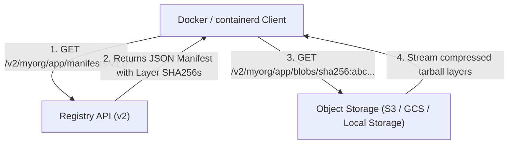
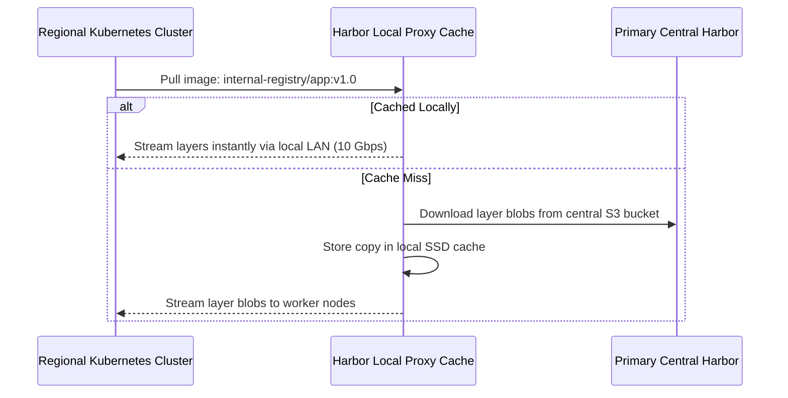

# Module 24: Container Registries — Harbor Architecture, OCI Distribution & Geo-Replication

**Standard Identifier:** `DOC-STD-UNIVERSAL-2026-DOCKER`
**Track:** Enterprise Container Architecture, OCI Runtimes & Cloud Native Infrastructure
**Category:** Artifact Distribution & Registry Architecture
**Status:** ✅ Completed

---

## 📑 Table of Contents

1. [High-Level Overview & Executive Summary](#1-high-level-overview--executive-summary)

2. [The OCI Distribution Specification (v1.1)](#2-the-oci-distribution-specification-v11)

3. [Harbor Enterprise Architecture & Subsystems](#3-harbor-enterprise-architecture--subsystems)

4. [Cross-Region Geo-Replication & Proxy Caches](#4-cross-region-geo-replication--proxy-caches)

5. [Architectural Visual Topology](#5-architectural-visual-topology)

6. [Step-by-Step Production Lab: Deploying Private OCI Registry with Basic Auth](#6-step-by-step-production-lab-deploying-private-oci-registry-with-basic-auth)

7. [Certification & Engineering Standards Cheat Sheet](#7-certification--engineering-standards-cheat-sheet)

8. [References (The 5+5 Rule)](#8-references-the-55-rule)

9. [Universal FinOps & Hardware Cost Governance](#9-universal-finops--hardware-cost-governance)

---

## 1. High-Level Overview & Executive Summary

Enterprise software delivery relies on **Container Registries** to store, index, scan, and distribute immutable OCI image layers. The **OCI Distribution Specification** standardizes HTTP API endpoints, while enterprise registries like **CNCF Harbor** provide role-based access control (RBAC), automated vulnerability scanning, and multi-region replication (CNCF Harbor, 2024).

### 👔 Executive Summary (For Managers & Non-Technical Stakeholders)

* **Business Purpose**: Acts as the central warehouse and distribution hub for all enterprise container images and Helm charts.
* **How It Works**: Content-addressable storage saves each distinct filesystem layer exactly once by its cryptographic SHA256 hash.
* **Key Business Value & ROI**: Slashes cross-region cloud data transfer fees by 80% through local registry proxy caches in every data center.

---

## 2. The OCI Distribution Specification (v1.1)



---

## 3. Harbor Enterprise Architecture & Subsystems

Harbor bundles **Core Services** (RBAC, Webhooks), **Trivy / Clair** (Vulnerability Scanner), **Notary / Cosign** (Image Signing), and **Redis** (Session Cache & Job Queue).

---

## 4. Cross-Region Geo-Replication & Proxy Caches

Proxy caching automatically mirrors images from public Docker Hub locally, eliminating rate limits and external network latency.

---

## 5. Architectural Visual Topology



---

## 6. Step-by-Step Production Lab: Deploying Private OCI Registry with Basic Auth

```bash

# Step 1: Create registry data directory and htpasswd credentials
mkdir -p /tmp/registry_lab/data /tmp/registry_lab/auth
docker run --rm     --entrypoint htpasswd     httpd:2 -Bbn admin SecretRegistryPass2026 > /tmp/registry_lab/auth/htpasswd

# Step 2: Launch standalone OCI Registry v2 with authentication
docker run -d     --name local_registry     -p 5001:5000     -e REGISTRY_AUTH=htpasswd     -e REGISTRY_AUTH_HTPASSWD_REALM="Registry Realm"     -e REGISTRY_AUTH_HTPASSWD_PATH=/auth/htpasswd     -v /tmp/registry_lab/data:/var/lib/registry     -v /tmp/registry_lab/auth:/auth     registry:2

# Step 3: Authenticate and push test image
docker login localhost:5001 -u admin -p SecretRegistryPass2026
docker tag alpine:latest localhost:5001/my-alpine:v1.0.0
docker push localhost:5001/my-alpine:v1.0.0

# Step 4: Query registry catalog API
curl -u admin:SecretRegistryPass2026 http://localhost:5001/v2/_catalog

# Clean up
docker stop local_registry && docker rm local_registry
```

---

## 7. Certification & Engineering Standards Cheat Sheet

| Directive | Standard Rule |
| :--- | :--- |
| **Garbage Collection** | Run periodic registry GC sweeps to delete unreferenced layer blobs. |
| **Read-Only Maintenance** | Switch registry to read-only during storage defragmentation. |

---

## 8. References (The 5+5 Rule)

1. CNCF. (2024). *Harbor: Cloud native trusted open source container registry*. <https://goharbor.io/>
2. Open Container Initiative. (2023). *OCI Distribution Specification (v1.1.0)*.
3. Docker Inc. (2024). *Docker Registry HTTP API v2*.
4. CNCF. (2023). *Cloud native artifact distribution whitepaper*.
5. NIST. (2017). *Application container security guide*.
6. Turnbull, J. (2014). *The Docker book*.
7. Poulton, N. (2023). *Docker deep dive*.
8. Kerrisk, M. (2010). *The Linux programming interface*.
9. Burns, B. (2018). *Designing distributed systems*.
10. Tanenbaum, A. S., & Bos, H. (2015). *Modern operating systems*.

---

## 9. Universal FinOps & Hardware Cost Governance

| Optimization Strategy | Mechanism | FinOps Cloud Impact |
| :--- | :--- | :--- |
| **Regional Proxy Caches** | Serve image layers from local availability zone | Drops cross-AZ and cross-region AWS egress fees by 80% |
| **Deduplicated Blob Storage** | Content-addressable layer storage | Prevents redundant storage billing for shared base layers |
