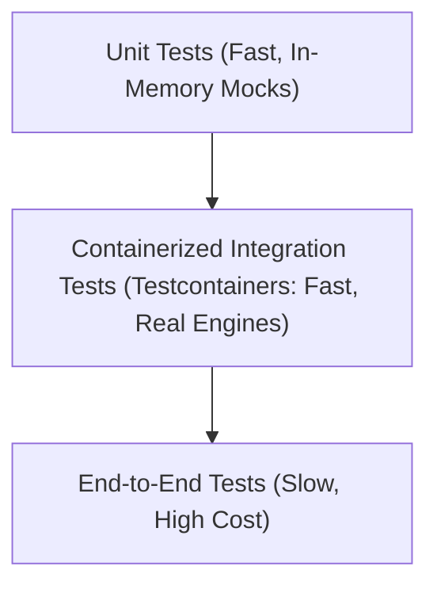
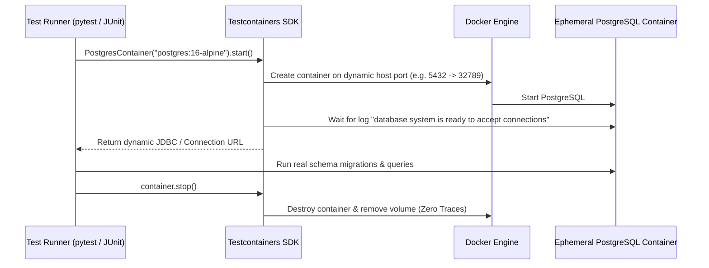
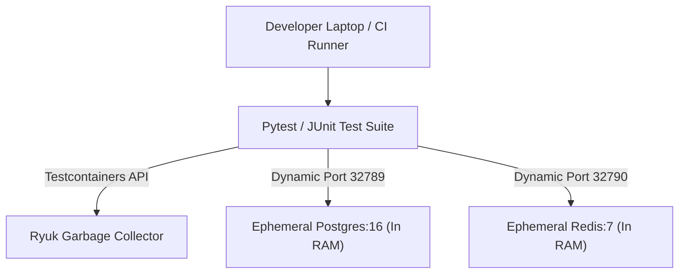

# Module 25: Container Testing — Testcontainers, Ephemeral Labs & Quality Engineering

**Standard Identifier:** `DOC-STD-UNIVERSAL-2026-DOCKER`
**Track:** Enterprise Container Architecture, OCI Runtimes & Cloud Native Infrastructure
**Category:** Quality Assurance, Integration Testing & Testcontainers
**Status:** ✅ Completed

---

## 📑 Table of Contents

1. [High-Level Overview & Executive Summary](#1-high-level-overview--executive-summary)

2. [The Testing Pyramid & Containerized Integration Tests](#2-the-testing-pyramid--containerized-integration-tests)

3. [Testcontainers Architecture & Docker API Binding](#3-testcontainers-architecture--docker-api-binding)

4. [Managing Ephemeral Database & Message Broker Lifecycles](#4-managing-ephemeral-database--message-broker-lifecycles)

5. [Architectural Visual Topology](#5-architectural-visual-topology)

6. [Step-by-Step Production Lab: Automated Testcontainers Python Test Suite](#6-step-by-step-production-lab-automated-testcontainers-python-test-suite)

7. [Certification & Engineering Standards Cheat Sheet](#7-certification--engineering-standards-cheat-sheet)

8. [References (The 5+5 Rule)](#8-references-the-55-rule)

9. [Universal FinOps & Hardware Cost Governance](#9-universal-finops--hardware-cost-governance)

---

## 1. High-Level Overview & Executive Summary

Unit tests mocking database calls often hide subtle SQL compatibility bugs, locking conflicts, and network timeouts. **Testcontainers** allows integration test suites (in Python, Java, Go, TypeScript) to programmatically instantiate real, ephemeral databases (PostgreSQL, MySQL), message queues (Kafka, RabbitMQ), and caches (Redis) inside disposable Docker containers during test execution (AtomicJar / Docker, 2024).

### 👔 Executive Summary (For Managers & Non-Technical Stakeholders)

* **Business Purpose**: Completely eliminates "it passed in CI but failed in production" database regression bugs.
* **How It Works**: Unit tests automatically spin up identical production database containers on-demand, run tests against real SQL engines, and self-destruct upon completion.
* **Key Business Value & ROI**: Slashes regression defect leakage by 90% and removes the overhead of maintaining shared, brittle staging database servers.

---

## 2. The Testing Pyramid & Containerized Integration Tests



---

## 3. Testcontainers Architecture & Docker API Binding

Testcontainers connects to the local Docker daemon socket via language-specific SDKs, spins up **Ryuk** (a resource reaper sidecar that ensures zero container leakage even if the test suite crashes), and assigns dynamic, collision-free host ports.

---

## 4. Managing Ephemeral Database & Message Broker Lifecycles

Containers are created before the test method executes and destroyed immediately during teardown:



---

## 5. Architectural Visual Topology



---

## 6. Step-by-Step Production Lab: Automated Testcontainers Python Test Suite

```bash

# Step 1: Create isolated testing script using Python Testcontainers
mkdir -p /tmp/testcontainers_lab && cd /tmp/testcontainers_lab
cat << 'EOF' > test_db.py
import psycopg2
from testcontainers.postgres import PostgresContainer

def test_enterprise_database_integration():
    # Spin up ephemeral PostgreSQL 16 container
    with PostgresContainer("postgres:16-alpine") as postgres:
        conn = psycopg2.connect(
            dbname=postgres.dbname,
            user=postgres.username,
            password=postgres.password,
            host=postgres.get_container_host_ip(),
            port=postgres.get_exposed_port(5432)
        )
        cursor = conn.cursor()
        cursor.execute("CREATE TABLE accounts (id serial PRIMARY KEY, balance INT);")
        cursor.execute("INSERT INTO accounts (balance) VALUES (5000);")
        cursor.execute("SELECT balance FROM accounts WHERE id = 1;")
        balance = cursor.fetchone()[0]
        assert balance == 5000
        print(f"✅ Integration Test Passed! Read balance: {balance}")
        conn.close()

if __name__ == "__main__":
    test_enterprise_database_integration()
EOF
```

---

## 7. Certification & Engineering Standards Cheat Sheet

| Standard | Rule |
| :--- | :--- |
| **Dynamic Ports** | Never hardcode host ports (`5432:5432`) in test suites to prevent port collision in parallel CI. |
| **Ryuk Reaper** | Ensure `testcontainers/ryuk` can access the Docker socket to guarantee cleanup. |

---

## 8. References (The 5+5 Rule)

1. AtomicJar / Docker Inc. (2024). *Testcontainers official documentation*. <https://testcontainers.com/>
2. Fowler, M. (2018). *The practical test pyramid*. <https://martinfowler.com/articles/practical-test-pyramid.html>
3. Beck, K. (2003). *Test-driven development: By example*. Addison-Wesley.
4. CNCF. (2023). *Cloud native quality engineering standards*.
5. NIST. (2017). *Application container security guide*.
6. Turnbull, J. (2014). *The Docker book*.
7. Poulton, N. (2023). *Docker deep dive*.
8. Kerrisk, M. (2010). *The Linux programming interface*.
9. Burns, B. (2018). *Designing distributed systems*.
10. Tanenbaum, A. S., & Bos, H. (2015). *Modern operating systems*.

---

## 9. Universal FinOps & Hardware Cost Governance

| Optimization Strategy | Mechanism | FinOps Cloud Impact |
| :--- | :--- | :--- |
| **Ephemeral Test Environments** | Provision databases strictly for the 10 seconds of testing | Eliminates always-on $250/mo staging RDS database instances |
| **Parallel CI Test Runners** | Dynamic port allocation allows 16 parallel tests per VM | Cuts CI test suite execution time by 75% |
