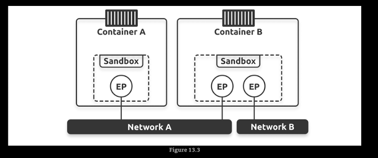
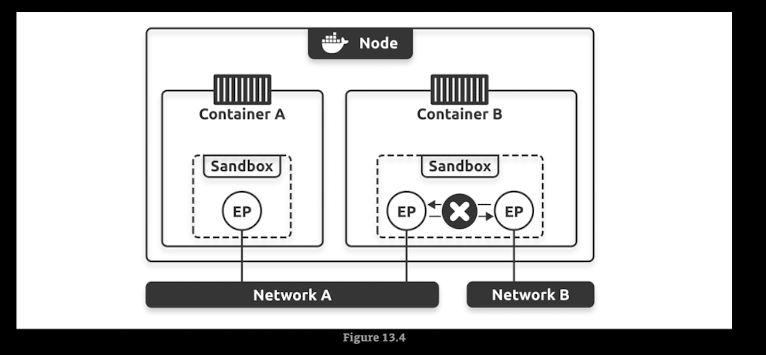
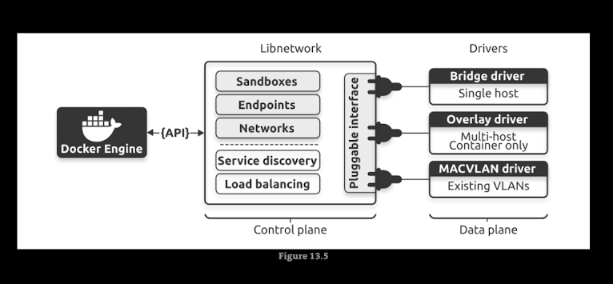
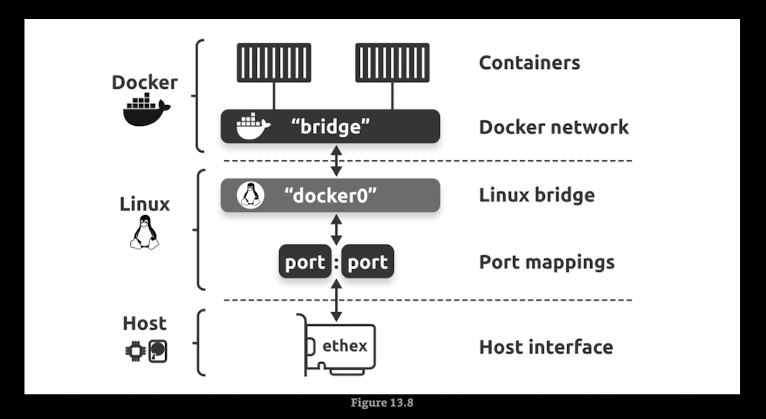

# Docker Networking

Docker provides several networking options to allow containers to communicate with each other and with the outside world. Here are some of the common Docker networking modes:

1. **Bridge Network**: This is the default network mode. Containers on the same bridge network can communicate with each other using their container names as hostnames. You can create a custom bridge network to isolate containers.

2. **Host Network**: In this mode, the container shares the host's network stack. This means that the container can directly access the host's network interfaces and ports. However, this mode is not recommended for production environments due to security concerns.

3. **Overlay Network**: This mode allows containers running on different Docker hosts to communicate with each other. It uses a distributed key-value store to manage the network state and is commonly used in Docker Swarm and Kubernetes.

4. **Macvlan Network**: This mode allows you to assign a MAC address to a container, making it appear as a physical device on the network. This can be useful for applications that require direct access to the network.

5. **None Network**: In this mode, the container has no network connectivity. This can be useful for containers that do not require network access.

* The Container Network Model (CNM): is the design specification and outlines the fundamental building blocks of a Docker network
    * Sandboxes
    * Endpoints
    * Networks

* Libnetwork: is a real-world implementation of the CNM.It is open-sourced as part of the Moby project and used by Docker and other platform

* Drivers: extend the model by implementing specific network topologies such as VXLAN overlay networks

## Commands

* `docker network ls`: List all networks
* `docker network inspect <network_name>`: Display detailed information about a specific network