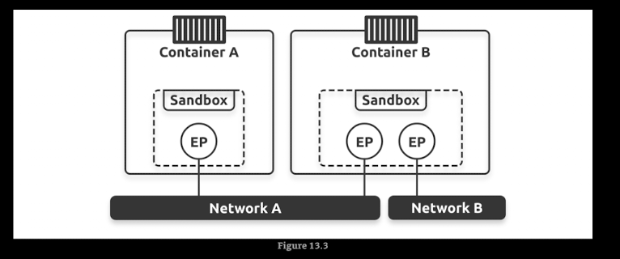
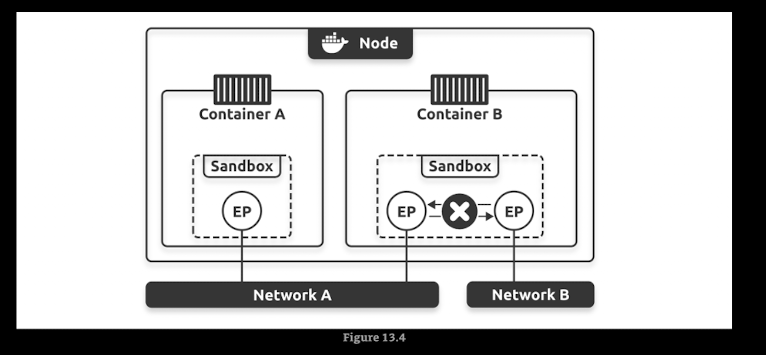
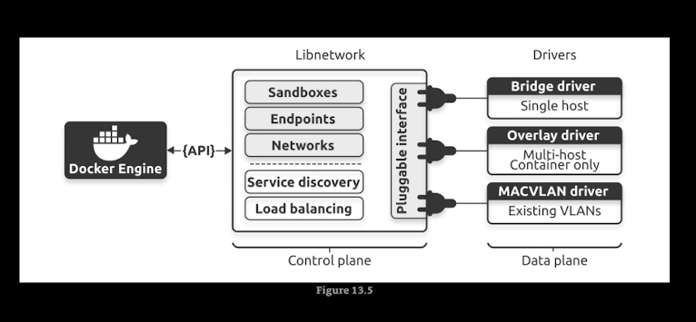
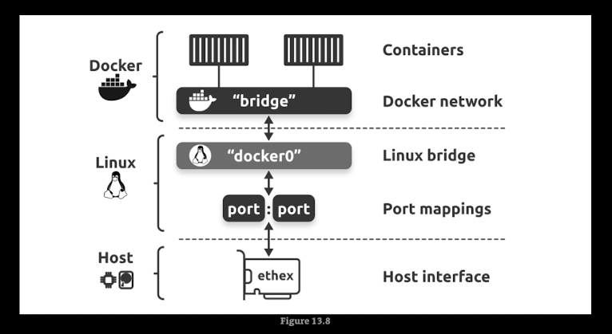

# Module: Docker Networking, Service Discovery & DNS
**Category:** Container Networking & Micro-Segmentation
**Status:** ✅ Completed

---

## 1. High-Level Overview
Docker networking provides the communication fabric that connects containers with each other, with the host operating system, and with external networks. Docker implements the **Container Network Model (CNM)** via the `libnetwork` library, supporting multiple network drivers: **Bridge** (default private network on a single host with automatic DNS service discovery), **Host** (removes network isolation, binding container directly to host network stack), **Overlay** (multi-host VXLAN tunnel networking for Docker Swarm), **Macvlan / Ipvlan** (assigning physical MAC/IP addresses to containers directly on the underlay LAN), and **None** (completely disables networking for zero-trust workloads).

### 👔 Executive Summary (For Managers & Non-Technical Stakeholders)
* **Business Purpose**: Connects software services securely so they can exchange data, balance web traffic, and block unauthorized network access to sensitive databases.
* **How It Works**: Creates isolated virtual software networks inside the server. Applications discover each other automatically by name (e.g. `api-service` connects to `database`), while external firewalls block external intruders.
* **Key Business Value & Use Cases**: Delivers zero-trust network isolation between internal business services, prevents data breaches, and eliminates manual IP address management.

---

## 2. Docker Network Drivers Breakdown

| Network Driver | Scope | Routing Model | Primary Use Case |
| :--- | :--- | :--- | :--- |
| **Bridge (User-Defined)** | Single Host | Linux virtual bridge (`br-xxx`) + embedded DNS | Standard multi-container applications with automatic name resolution |
| **Host** | Single Host | Shares host network namespace directly | Ultra-high throughput, latency-critical networking (eliminates NAT) |
| **Overlay** | Multi-Host | VXLAN overlay encapsulation (UDP port 4789) | Docker Swarm multi-node distributed microservices |
| **Macvlan** | Single Host | Assigns unique MAC address from physical LAN | Legacy applications requiring direct physical network IP routing |
| **None** | Container | Loopback interface only (`127.0.0.1`) | High-security air-gapped batch computation |

---

## 📌 CNM Architecture, Libnetwork & Diagrams (Original Notes)

### Container Network Model (CNM) Building Blocks
The CNM defines the formal architecture for Docker networking:
* **Sandboxes**: An isolated network stack containing container interfaces, routing tables, and DNS configuration (maps to Linux network namespace).
* **Endpoints**: Virtual network interfaces (veth pairs) that attach a Sandbox to a Network.
* **Networks**: A collection of directly communicating Endpoints (e.g. Linux bridge or 802.1Q VLAN).





### Libnetwork & Network Drivers
* **Libnetwork**: The canonical open-source Go implementation of the CNM, part of the Moby project.
* **Drivers**: Pluggable modules that implement specific topologies (Bridge, Overlay VXLAN, Macvlan).





### Network Discovery Commands
```bash
docker network ls
docker network inspect internal-app-net
```

---

## 3. Hands-On Walkthrough: Creating an Isolated Bridge Network with Automatic DNS
### Step 1: Create a Custom Bridge Network
Provision an isolated user-defined network:
```bash
docker network create \
    --driver bridge \
    --subnet 172.28.0.0/16 \
    internal-app-net
```

### Step 2: Attach Containers to the Custom Network
Launch backend database and frontend client on the custom network:
```bash
docker run -d \
    --name backend-db \
    --network internal-app-net \
    redis:alpine \
    && docker run -d \
        --name frontend-app \
        --network internal-app-net \
        alpine sleep 3600
```

### Step 3: Test Automatic DNS Name Resolution
Verify that `frontend-app` can resolve `backend-db` by container name:
```bash
docker exec frontend-app ping -c 3 backend-db
```

### Step 4: Cleanup
Stop and remove containers and network:
```bash
docker rm -f backend-db frontend-app \
    && docker network rm internal-app-net
```

---

## 4. Pure CLI Commands
### 1. List All Docker Networks
Inspect network drivers and scope:
```bash
docker network ls
```

### 2. Inspect Connected Containers on a Network
Query all IP addresses allocated on a network:
```bash
docker network inspect internal-app-net \
    --format '{{range .Containers}}{{.Name}} - {{.IPv4Address}}{{println}}{{end}}'
```

---

## References

### Official Documentation
* [Docker Networking Overview](https://docs.docker.com/network/) - Drivers, architecture, and configuration.
* [Bridge Network User Guide](https://docs.docker.com/network/drivers/bridge/) - User-defined bridge networks and DNS.
* [Overlay Networks in Docker Swarm](https://docs.docker.com/network/drivers/overlay/) - Multi-host VXLAN tunneling.
* [Macvlan Network Driver Reference](https://docs.docker.com/network/drivers/macvlan/) - Direct physical network binding.
* [Docker Embedded DNS Server](https://docs.docker.com/network/#dns-services) - Automatic name resolution mechanics (`127.0.0.11`).

### Authoritative Web Pages, Blogs & Tutorials
* [Julia Evans: How Linux Virtual Networking Works (Bridges and Veth Pairs)](https://jvns.ca/) - Illustrated packet lifecycle.
* [A Cloud Guru: Docker Certified Associate (DCA) Networking](https://www.pluralsight.com/) - Exam networking scenarios.
* [Datadog Engineering: Monitoring Docker Network Throughput and Packet Drops](https://www.datadoghq.com/blog/) - Network telemetry best practices.
* [Snyk Security: Preventing Container Network Lateral Movement](https://snyk.io/) - Zero-trust segmentation.
* [FinOps Foundation: Slashing Cloud Cross-AZ Data Transfer in Docker](https://www.finops.org/) - Network cost optimization.

---

## FinOps & Resource Cost Governance in Container Environments

*Financial Operations (FinOps) in Docker and containerized environments focuses on minimizing container resource waste, optimizing image transfer bandwidth, maximizing host server bin-packing, and eliminating orphaned storage volumes.*

### 1. Cost Visibility & Container Resource Allocation
- **Container Sizing Baselines** – Measure real-world CPU and memory usage using `docker stats` and cgroup metrics. Avoid running containers without resource constraints (`--memory` and `--cpus`), which lead to noisy-neighbor resource starvation and premature host scaling.
- **Labeling for Cost Allocation** – Apply standardized Docker labels (`com.company.environment=prod`, `com.company.owner=sre-team`, `com.company.costcenter=104`) to all containers and images to enable automated container showback and chargeback.

### 2. Image Layer Optimization & Bandwidth Reduction
- **Multi-Stage Builds** – Utilize multi-stage Docker builds to eliminate build-time dependencies, compilers, and source files from final production container images, reducing image sizes by up to 80-95% (e.g. from 1.2GB to 45MB).
- **Minimal Base Images** – Use minimal base images like Alpine Linux or distroless images (`gcr.io/distroless`) to reduce cloud container registry storage costs and network egress transfer fees during deployment pipelines.

### 3. Storage Volume & Image Pruning Automation
- **Orphaned Volume Purging** – Dangling Docker volumes (`docker volume ls -f dangling=true`) continue to consume expensive cloud block storage. Automate periodic execution of `docker system prune --volumes -f` via cron jobs to reclaim lost storage.
- **Container Registry Retention Policies** – Configure automatic lifecycle rules on container registries (AWS ECR, Docker Hub, Harbor) to delete untagged and older image tags after 14-30 days.

### 4. Continuous Optimization Lifecycle
- **Host Bin-Packing** – Increase container density per host machine by setting strict memory boundaries (`--memory-reservation`), allowing higher server consolidation and slashing cloud virtual machine counts by 40-60%.
- **Development Fleet Cleanup** – Automate the shutdown of local and staging Docker Compose stacks outside business hours to eliminate idle compute spend.
