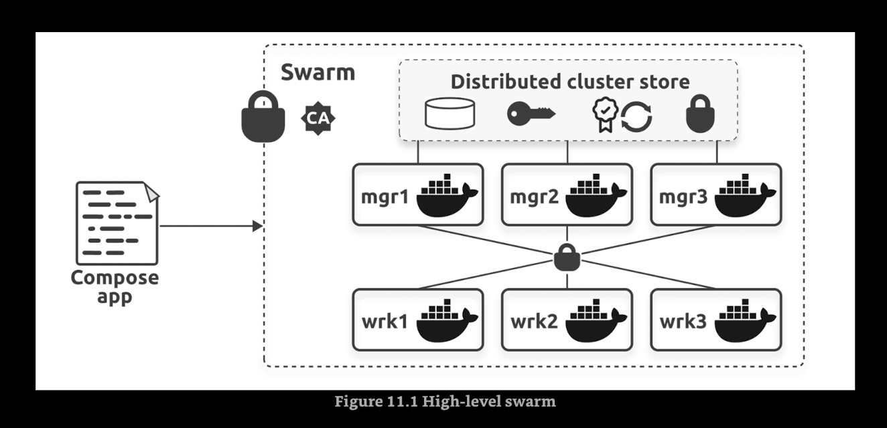

# Docker Swarm

It is similar to Kubernetes. A swarm is one or more Docker nodes that can be physical servers, VMs, cloud instances, Raspberry Pi's, and more.

* swarm
    * node 1:
        * manager 1
        * worker 1
    * node 2:
        * manager 2
        * worker 2

## Build a secure swarm