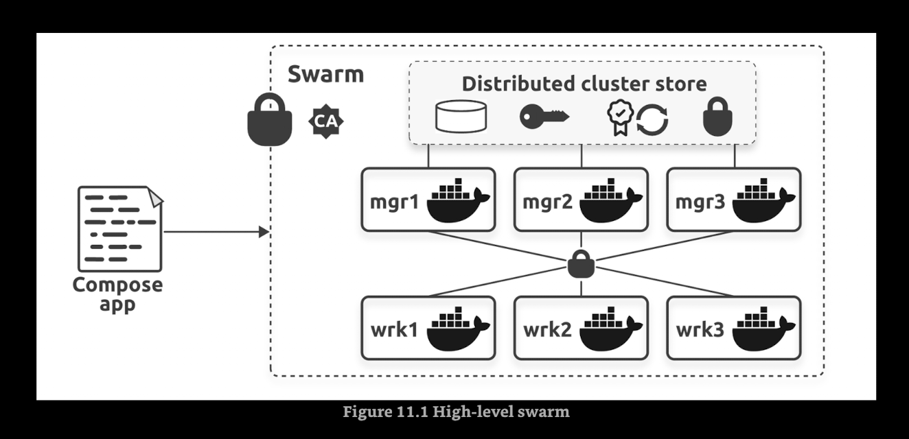

# Module: Docker Swarm Mode & Multi-Host Clustering
**Category:** Native Container Clustering & High Availability
**Status:** ✅ Completed

---

## 1. High-Level Overview
**Docker Swarm** is Docker's native clustering and container orchestration engine built directly into the Docker Engine. Swarm transforms a pool of individual Docker hosts into a single, highly available virtual Docker engine. Operating on a decentralized **Raft consensus algorithm**, Swarm nodes are designated as **Manager Nodes** (responsible for cluster state, API dispatching, service scheduling, and quorum maintenance) or **Worker Nodes** (responsible for executing container tasks). Swarm provides built-in declarative **Services**, automated ingress routing mesh (Layer 4 load balancing across all cluster nodes), rolling updates, and cryptographic mutual TLS (mTLS) for all node-to-node communications.

### 👔 Executive Summary (For Managers & Non-Technical Stakeholders)
* **Business Purpose**: Groups multiple physical or virtual servers into a unified, high-availability computing cluster that keeps software running even if individual servers crash.
* **How It Works**: Designates manager servers to coordinate the cluster. When traffic spikes or a server fails, Swarm automatically redistributes application tasks across healthy servers with zero manual intervention.
* **Key Business Value & Use Cases**: Provides native high-availability and automated self-healing without the high operational complexity of Kubernetes, ideal for mid-sized enterprise workloads and edge environments.

---

## 2. Swarm Architecture & Raft Consensus

```
Manager Quorum (Raft Consensus: (N/2)+1)
+-------------------------------------------------------------+
|  Manager Node 1 (Leader) <---> Manager Node 2 <---> Manager Node 3  |
+-------------------------------------------------------------+
                                |
             +------------------+------------------+
             |                                     |
             v                                     v
+---------------------------+       +---------------------------+
|       Worker Node 1       |       |       Worker Node 2       |
| (Task 1: web | Task 2: db)|       | (Task 3: web | Task 4: db)|
+---------------------------+       +---------------------------+
```

---

## 📌 Swarm Fundamentals, Hierarchy & Topology (Original Notes)

* **Orchestration Concept**: Similar to Kubernetes, a swarm pools one or more Docker nodes (physical bare-metal servers, VMs, cloud compute instances, Raspberry Pi clusters, or edge appliances).
* **Node Roles & Hierarchy**:
  * **Swarm Cluster**:
    * **Node 1**: Manager 1 (Raft consensus) + Worker 1 (Task execution)
    * **Node 2**: Manager 2 (Standby leader) + Worker 2 (Task execution)



### Building a Secure Swarm
Swarm automatically initializes an internal PKI (Public Key Infrastructure) root Certificate Authority (CA) on cluster creation. Every node joining receives an X.509 certificate with automatic 90-day certificate rotation and mTLS encryption.

---

## 3. Hands-On Walkthrough: Initializing Swarm & Deploying a Replicated Service
### Step 1: Initialize Docker Swarm on Manager Node
Bootstrap the Swarm cluster:
```bash
docker swarm init \
    --advertise-addr 127.0.0.1
```

### Step 2: Deploy a Declarative Replicated Service
Deploy an Nginx service with 3 replicas and rolling update configuration:
```bash
docker service create \
    --name cluster-web \
    --replicas 3 \
    --update-parallelism 1 \
    --update-delay 10s \
    -p 8080:80 \
    nginx:alpine
```

### Step 3: Inspect Service Tasks and Distribution
Check active task placement across nodes:
```bash
docker service ps cluster-web
```

### Step 4: Scale the Service Horizontally
Scale service up to 5 replicas dynamically:
```bash
docker service scale cluster-web=5
```

---

## 4. Pure CLI Commands
### 1. List Swarm Cluster Nodes and Status
Inspect leader and active worker nodes:
```bash
docker node ls
```

### 2. Perform a Rolling Update on Swarm Service
Update service image version with automated rollback on failure:
```bash
docker service update \
    --image nginx:1.26-alpine \
    --rollback-on-failure \
    cluster-web
```

---

## References

### Official Documentation
* [Docker Swarm Mode Overview](https://docs.docker.com/engine/swarm/) - Native clustering guide.
* [Docker Service Creation & Lifecycle](https://docs.docker.com/engine/swarm/services/) - Replicated and global services.
* [Swarm Raft Consensus & Quorum](https://docs.docker.com/engine/swarm/raft/) - Manager node high availability.
* [Swarm Ingress Routing Mesh](https://docs.docker.com/engine/swarm/ingress/) - Multi-host Layer 4 load balancing.
* [Swarm PKI and Mutual TLS](https://docs.docker.com/engine/swarm/how-swarm-mode-works/pki/) - Automatic node certificate rotation.

### Authoritative Web Pages, Blogs & Tutorials
* [Docker Engineering Blog: Deep Dive on the Ingress Routing Mesh](https://www.docker.com/blog/) - IPVS-based traffic routing.
* [A Cloud Guru: Docker Certified Associate (DCA) Swarm Masterclass](https://www.pluralsight.com/) - Swarm clustering scenarios.
* [Datadog Engineering: Monitoring Docker Swarm Cluster Health](https://www.datadoghq.com/blog/) - Swarm telemetry and alerts.
* [Snyk Security: Securing Multi-Host Docker Swarm Clusters](https://snyk.io/) - Overlay network encryption.
* [FinOps Foundation: Resource Allocation in Swarm Clusters](https://www.finops.org/) - Bin-packing and node scaling.

---

## FinOps & Resource Cost Governance in Container Environments

*Financial Operations (FinOps) in Docker and containerized environments focuses on minimizing container resource waste, optimizing image transfer bandwidth, maximizing host server bin-packing, and eliminating orphaned storage volumes.*

### 1. Cost Visibility & Container Resource Allocation
- **Container Sizing Baselines** – Measure real-world CPU and memory usage using `docker stats` and cgroup metrics. Avoid running containers without resource constraints (`--memory` and `--cpus`), which lead to noisy-neighbor resource starvation and premature host scaling.
- **Labeling for Cost Allocation** – Apply standardized Docker labels (`com.company.environment=prod`, `com.company.owner=sre-team`, `com.company.costcenter=104`) to all containers and images to enable automated container showback and chargeback.

### 2. Image Layer Optimization & Bandwidth Reduction
- **Multi-Stage Builds** – Utilize multi-stage Docker builds to eliminate build-time dependencies, compilers, and source files from final production container images, reducing image sizes by up to 80-95% (e.g. from 1.2GB to 45MB).
- **Minimal Base Images** – Use minimal base images like Alpine Linux or distroless images (`gcr.io/distroless`) to reduce cloud container registry storage costs and network egress transfer fees during deployment pipelines.

### 3. Storage Volume & Image Pruning Automation
- **Orphaned Volume Purging** – Dangling Docker volumes (`docker volume ls -f dangling=true`) continue to consume expensive cloud block storage. Automate periodic execution of `docker system prune --volumes -f` via cron jobs to reclaim lost storage.
- **Container Registry Retention Policies** – Configure automatic lifecycle rules on container registries (AWS ECR, Docker Hub, Harbor) to delete untagged and older image tags after 14-30 days.

### 4. Continuous Optimization Lifecycle
- **Host Bin-Packing** – Increase container density per host machine by setting strict memory boundaries (`--memory-reservation`), allowing higher server consolidation and slashing cloud virtual machine counts by 40-60%.
- **Development Fleet Cleanup** – Automate the shutdown of local and staging Docker Compose stacks outside business hours to eliminate idle compute spend.
