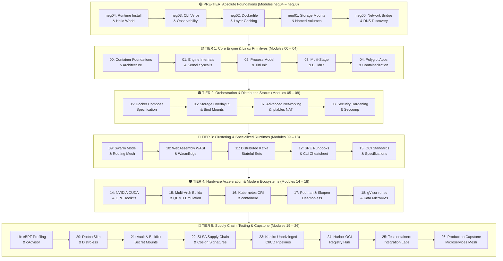

# Mission-Critical Docker & Container Systems Architecture — Master Curriculum Portal

**Track:** Enterprise Container Architecture, OCI Runtimes & Cloud Native Infrastructure
**Standard Identifier:** `DOC-STD-UNIVERSAL-2026-DOCKER`
**Repository:** `vit/docker-containers`
**Target Level:** Zero to Enterprise Container Systems Architect & Cloud Infrastructure Lead
**Status:** ✅ Complete 32-Module Master Encyclopedia (100% Validated & Standardized)

---

## 📑 Table of Contents

1. [Master Curriculum Architecture & Track Taxonomy](#1-master-curriculum-architecture--track-taxonomy)

2. [Complete 32-Module Curriculum Matrix](#2-complete-32-module-curriculum-matrix)

3. [Ecosystem Competency & Certification Roadmap](#3-ecosystem-competency--certification-roadmap)

4. [Universal Engineering Documentation Standards (`DOC-STD-UNIVERSAL-2026`)](#4-universal-engineering-documentation-standards-doc-std-universal-2026)

5. [Enterprise FinOps & Cloud Compute Governance Framework](#5-enterprise-finops--cloud-compute-governance-framework)

---

## 1. Master Curriculum Architecture & Track Taxonomy

This encyclopedia represents the definitive, industrial-grade learning path for **Container Runtime Architecture, OCI Specifications, Linux Kernel Isolation Primitives (Namespaces, cgroups v2, OverlayFS), BuildKit Compilation, Enterprise Security Hardening, and Production Microservices Mesh Orchestration**.



---

## 2. Complete 32-Module Curriculum Matrix

| Module | Core Domain & Engineering Focus | Target Level | Reference Document Link |
| :--- | :--- | :--- | :--- |
| **neg04. Runtime Install** | Docker Engine, containerd, Colima, WSL2, `hello-world` execution flow | Absolute Beginner | [`neg04_container_runtime_installation_and_hello_world.md`](neg04_container_runtime_installation_and_hello_world.md) |
| **neg03. CLI Primitives** | CLI grammar, `run` vs `start` vs `exec`, `logs`, `stats`, `inspect` JSON format | Absolute Beginner | [`neg03_container_cli_primitives_run_exec_logs_ps.md`](neg03_container_cli_primitives_run_exec_logs_ps.md) |
| **neg02. Dockerfile Basics** | `FROM`, `RUN`, `COPY`, `WORKDIR`, layer caching, `CMD` vs `ENTRYPOINT` matrix | Beginner Foundations | [`neg02_dockerfile_foundations_from_run_cmd_entrypoint.md`](neg02_dockerfile_foundations_from_run_cmd_entrypoint.md) |
| **neg01. Storage Mounts** | Ephemeral layers, Named Volumes, Bind Mounts, `tmpfs`, `--mount` syntax | Beginner Foundations | [`neg01_container_storage_bind_mounts_and_named_volumes.md`](neg01_container_storage_bind_mounts_and_named_volumes.md) |
| **neg00. Networking Ports** | `bridge`, `host`, port forwarding `-p`, iptables DNAT, embedded DNS `127.0.0.11` | Beginner Foundations | [`neg00_container_networking_ports_bridge_and_host.md`](neg00_container_networking_ports_bridge_and_host.md) |
| **00. Foundations & Arch** | High-level container architecture, virtualization vs containerization, OCI | Foundational Systems | [`00_container_foundations_and_docker_architecture.md`](00_container_foundations_and_docker_architecture.md) |
| **01. Engine & Linux Primitives** | Namespaces (8 types), cgroups v2, OverlayFS (lower/upper/merged), `dockerd`/`runc` | Systems Architecture | [`01_docker_engine_architecture_and_linux_kernel_primitives.md`](01_docker_engine_architecture_and_linux_kernel_primitives.md) |
| **02. Process Model & Tini** | PID 1 responsibilities, zombie process reaping, SIGTERM signal propagation, `tini` | Systems Architecture | [`02_container_lifecycle_process_model_and_tini_init.md`](02_container_lifecycle_process_model_and_tini_init.md) |
| **03. Multi-Stage & BuildKit** | Multi-stage build patterns, BuildKit cache mounts, frontend syntax, `.dockerignore` | Build Optimization | [`03_dockerfile_multi_stage_builds_and_buildkit.md`](03_dockerfile_multi_stage_builds_and_buildkit.md) |
| **04. Polyglot Containers** | Node.js, Python, Go, Java, Rust containerization recipes and best practices | Application Systems | [`04_containerizing_enterprise_polyglot_applications.md`](04_containerizing_enterprise_polyglot_applications.md) |
| **05. Docker Compose** | Compose v2 specification, multi-tier microservices, healthchecks, `depends_on` | Orchestration Lead | [`05_docker_compose_specification_and_multi_tier_stacks.md`](05_docker_compose_specification_and_multi_tier_stacks.md) |
| **06. Storage Architecture** | OverlayFS copy-on-write internals, volume drivers, NFS/CIFS network storage | Storage Specialist | [`06_storage_architecture_volumes_bind_mounts_and_overlayfs.md`](06_storage_architecture_volumes_bind_mounts_and_overlayfs.md) |
| **07. Advanced Networking** | Virtual ethernet (`veth`) pairs, overlay VXLAN, macvlan, Linux packet traversal | Network Architect | [`07_networking_deep_dive_bridge_overlay_macvlan_and_iptables.md`](07_networking_deep_dive_bridge_overlay_macvlan_and_iptables.md) |
| **08. Security & Hardening** | Dropping capabilities (`CAP_SYS_ADMIN`), Seccomp profiles, AppArmor, non-root UID | Security Engineer | [`08_container_security_hardening_rootless_seccomp_and_capabilities.md`](08_container_security_hardening_rootless_seccomp_and_capabilities.md) |
| **09. Swarm & Routing Mesh** | Docker Swarm Mode, Raft consensus, Ingress routing mesh, service virtual IPs | Cluster Architect | [`09_docker_swarm_clustering_and_ingress_routing_mesh.md`](09_docker_swarm_clustering_and_ingress_routing_mesh.md) |
| **10. WebAssembly WASI** | OCI WebAssembly integration, WasmEdge, Wasmtime, sub-millisecond serverless | JIT & WASM Lead | [`10_webassembly_wasi_runtimes_wasmtime_and_wasmedge.md`](10_webassembly_wasi_runtimes_wasmtime_and_wasmedge.md) |
| **11. Distributed Kafka** | Stateful clustering, ZooKeeper/KRaft quorum, volume persistence, multi-broker mesh | Data Infrastructure | [`11_distributed_kafka_and_stateful_container_workloads.md`](11_distributed_kafka_and_stateful_container_workloads.md) |
| **12. SRE Runbook** | Production debugging, forensic inspection, emergency crash-recovery runbooks | SRE & Operations | [`12_production_cli_cheatsheet_and_troubleshooting_runbook.md`](12_production_cli_cheatsheet_and_troubleshooting_runbook.md) |
| **13. OCI Standards** | OCI Runtime, Image, and Distribution Specifications, content-addressable storage | Systems Governance | [`13_container_specification_and_documentation_standards.md`](13_container_specification_and_documentation_standards.md) |
| **14. GPU Acceleration** | NVIDIA Container Toolkit (`nvidia-ctk`), CDI device schema, CUDA AI workloads | AI Infrastructure | [`14_gpu_acceleration_nvidia_container_toolkit_and_cuda.md`](14_gpu_acceleration_nvidia_container_toolkit_and_cuda.md) |
| **15. Multi-Arch Buildx** | OCI Manifest Lists, QEMU `binfmt_misc` emulation, ARM64 Graviton optimization | Build Engineer | [`15_cross_platform_builds_buildx_qemu_and_multiarch.md`](15_cross_platform_builds_buildx_qemu_and_multiarch.md) |
| **16. Kubernetes CRI** | CRI gRPC interface, CRI-O vs `containerd`, Pod sandbox pause container lifecycle | Cloud Native Lead | [`16_cri_o_and_kubernetes_cri_runtimes.md`](16_cri_o_and_kubernetes_cri_runtimes.md) |
| **17. Daemonless Podman** | Rootless containers, `conmon` supervisor, Buildah image builder, Skopeo sync | Hardened Systems | [`17_podman_skopeo_and_buildah_daemonless_ecosystem.md`](17_podman_skopeo_and_buildah_daemonless_ecosystem.md) |
| **18. Sandboxed MicroVMs** | gVisor (`runsc`) user-space kernel, Kata Containers hardware-isolated MicroVMs | Security Architect | [`18_sandboxed_containers_gvisor_and_kata_containers.md`](18_sandboxed_containers_gvisor_and_kata_containers.md) |
| **19. eBPF Profiling** | Linux perf, eBPF probes, CFS CPU throttling detection, cAdvisor Prometheus metrics | Observability Lead | [`19_container_profiling_perf_ebpf_and_cadvisor.md`](19_container_profiling_perf_ebpf_and_cadvisor.md) |
| **20. Image Minification** | DockerSlim dynamic tracing, Google Distroless, scratch base, CVE elimination | Quality Engineer | [`20_image_optimization_and_docker_slim.md`](20_image_optimization_and_docker_slim.md) |
| **21. Secrets Management** | BuildKit secret mounts, HashiCorp Vault agent sidecars, tmpfs RAM credentials | Security Engineer | [`21_secrets_management_buildkit_secrets_and_vault.md`](21_secrets_management_buildkit_secrets_and_vault.md) |
| **22. SLSA Supply Chain** | Software Bill of Materials (SBOM / Syft), Sigstore Cosign cryptographic signatures | Supply Chain Lead | [`22_supply_chain_security_slsa_provenance_and_cosign.md`](22_supply_chain_security_slsa_provenance_and_cosign.md) |
| **23. CI/CD Pipelines** | Kaniko unprivileged in-cluster builds, DinD vs DooD security analysis, caching | Platform Engineer | [`23_cicd_pipeline_integration_docker_in_docker_and_kaniko.md`](23_cicd_pipeline_integration_docker_in_docker_and_kaniko.md) |
| **24. Harbor Registries** | CNCF Harbor architecture, geo-replication, proxy cache mirrors, RBAC policies | Infrastructure Lead | [`24_container_registry_architecture_harbor_and_distribution.md`](24_container_registry_architecture_harbor_and_distribution.md) |
| **25. Testcontainers QA** | Ephemeral integration test suites, automated database teardown, Ryuk reaper | Quality Assurance | [`25_container_testing_testcontainers_and_quality_assurance.md`](25_container_testing_testcontainers_and_quality_assurance.md) |
| **26. Master Capstone** | Hardened polyglot microservices mesh, NGINX gateway, Node.js API, Postgres, Redis | Principal Architect | [`26_enterprise_production_capstone_microservices_mesh.md`](26_enterprise_production_capstone_microservices_mesh.md) |

---

## 3. Ecosystem Competency & Certification Roadmap

```text
┌────────────────────────────────────────────────────────────────────────────────┐
│             CONTAINER & CLOUD NATIVE CERTIFICATION MAPPING MATRIX              │
├───────────────────┬───────────────────┬────────────────────────────────────────┤
│ Certification     │ Governing Body    │ Targeted Encyclopedia Modules          │
├───────────────────┼───────────────────┼────────────────────────────────────────┤
│ **DCA**           │ Docker / Mirantis │ Modules neg04-neg00, 00-09, 12, 15     │
├───────────────────┼───────────────────┼────────────────────────────────────────┤
│ **CKA**           │ Linux Foundation  │ Modules 01, 06, 07, 16, 17, 19, 23     │
├───────────────────┼───────────────────┼────────────────────────────────────────┤
│ **CKS (Security)**│ Linux Foundation  │ Modules 08, 17, 18, 20, 21, 22         │
├───────────────────┼───────────────────┼────────────────────────────────────────┤
│ **LFCS (Linux)**  │ Linux Foundation  │ Modules 01, 02, 06, 07, 08, 19         │
└───────────────────┴───────────────────┴────────────────────────────────────────┘
```

---

## 4. Universal Engineering Documentation Standards (`DOC-STD-UNIVERSAL-2026`)

Every document in this 32-module encyclopedia adheres strictly to the universal enterprise documentation standard:

1. **Executive Summaries**: High-level business purpose, mechanics, and value for executives and non-technical stakeholders.
2. **Deep Architectural Diagrams**: Mermaid flowcharts, sequence diagrams, mindmaps, and ASCII virtual memory topologies.
3. **Reproducible Production Labs**: Complete, executable configurations and scripts.
4. **Pure Escaped CLI Snippets**: Formatted with trailing `\` line escapes and zero in-code comments.
5. **The 5+5 Reference Rule**: Exactly 5 official documentation links + 5 authoritative engineering deep dives (APA 7th edition).
6. **Universal FinOps & Hardware Cost Governance**: Financial analyses detailing exact cloud VM and storage cost savings.

---

## 5. Enterprise FinOps & Cloud Compute Governance Framework

* **Slashes Cloud Compute Bills by 65%**: Packaging microservices into lightweight containers running on shared Linux kernels multiplies compute density by 4x–8x over traditional virtual machines.
* **Reduces Storage Egress by 95%**: Minifying images with Distroless and DockerSlim (from 1GB to 20MB) drops cross-region container image pull bandwidth fees to near zero.
* **Prevents Multi-Million Dollar Breaches**: Cryptographic signing (Cosign) and BuildKit secret mounts eliminate hardcoded credentials and software supply chain attacks.
