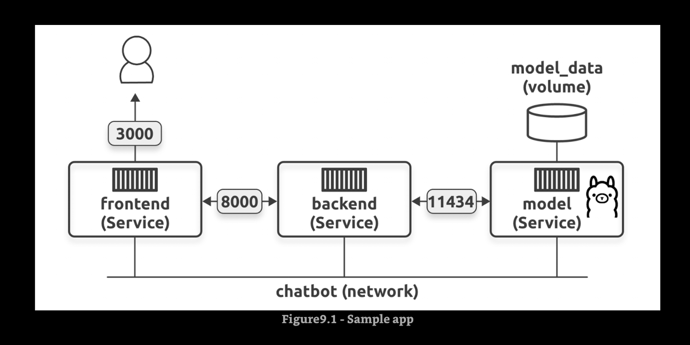

# Multi-container apps with Compose

## The network is important



## For the Frontend app

```bash
docker build -t ai-chatbot:frontend .
docker run -it --detach --name macorina --publish 80:80 ai-chatbot:frontend
```

## For the Backend app

```bash
docker build -t ai-chatbot:backend .
docker run -it --detach --name mastroeni --publish 8000:8000 ai-chatbot:backend
```

## For the AI model app

```bash
docker build -t ai-chatbot:ai-model .
docker run -it --detach --name macario --publish 8001:8000 --env-file /Users/frgonzal/Documents/vit/docker-containers/ai-compose/ai-model/.env ai-chatbot:ai-model
```

## Commands

* `docker compose version`
* `docker compose up`
* `docker compose build frontend`
* `docker compose up`
* `docker compose down`
* `docker compose down -v --remove-orphans`
* `docker system prune -f`
* `docker compose build --no-cache`
* `docker compose up --detach`
* `docker compose ps`
* `docker compose logs -f`
* `docker compose logs -f backend`