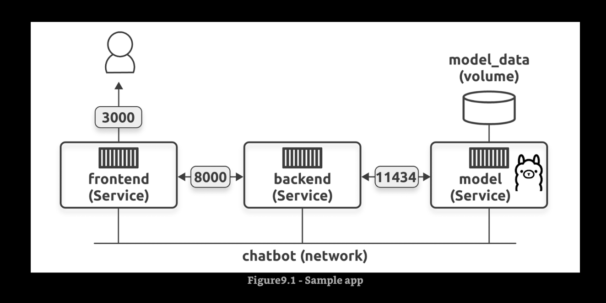

# Module: Multi-Container Applications with Docker Compose
**Category:** Multi-Service Orchestration & Declarative Stacks
**Status:** ✅ Completed

---

## 1. High-Level Overview
Modern enterprise architectures consist of multiple interacting services—web frontends, API gateways, background workers, caching tiers, and relational databases. **Docker Compose** is a declarative orchestration tool that allows developers to define, configure, and manage multi-container application stacks within a single version-controlled `compose.yaml` file. Compose automatically establishes shared user-defined bridge networks, persistent storage volume bindings, dependency startup order (`depends_on`), environment variable inheritance, and health-check-gated service initialization.

### 👔 Executive Summary (For Managers & Non-Technical Stakeholders)
* **Business Purpose**: Enables engineering teams to launch complex, multi-component software stacks (frontend, backend, database, cache) with a single command on any developer computer or test server.
* **How It Works**: Uses a single declarative blueprint (compose.yaml) to coordinate multiple containers, creating private network bridges so components can communicate securely while attaching permanent storage for databases.
* **Key Business Value & Use Cases**: Cuts developer local onboarding time from 3 days to 5 minutes, eliminates configuration divergence between team members, and provides fully automated testing environments for CI/CD pipelines.

---

## 2. Compose Specification & Service Architecture

```
                       User Request (:8080)
                                |
                                v
+-------------------------------------------------------------+
|                      Frontend Web Service                   |
|                   (Service: web | Port: 8080)               |
+-------------------------------------------------------------+
                                |
                                | (Private Bridge Network: app-net)
                                v
+-------------------------------------------------------------+
|                      Backend API Service                    |
|                   (Service: api | Port: 5000)               |
+-------------------------------------------------------------+
                                |
                +---------------+---------------+
                |                               |
                v                               v
+-------------------------------+ +---------------------------+
|      Redis Cache Tier         | |   PostgreSQL Database     |
|   (Service: redis:6379)       | |   (Service: db:5432)      |
+-------------------------------+ |   (Named Volume: db-data) |
                                  +---------------------------+
```

---

## 📌 Compose Evolution, Multi-Tier AI Stacks & Architecture (Original Notes)

### Network Isolation in Multi-Service Stacks



### Tool Evolution & Standards
* **Evolution**: `fig` (Python tool) -> `docker-compose` (Standalone Python CLI) -> `docker compose` (Go plugin built directly into Docker CLI).
* **Custom Compose File Invocation**: `docker compose -f ./llm/chatbot.yaml up`

### Manual Multi-Tier Container Provisioning (AI-Chatbot Stack)
Step-by-step build and execution of a multi-tier microservice architecture:
* **Frontend Tier (Web UI)**:
```bash
docker build -t ai-chatbot:frontend .
docker run -it --detach \
    --name macorina \
    --publish 80:80 \
    ai-chatbot:frontend
```
* **Backend Tier (REST API)**:
```bash
docker build -t ai-chatbot:backend .
docker run -it --detach \
    --name mastroeni \
    --publish 8000:8000 \
    ai-chatbot:backend
```
* **AI Model Tier (Inference Engine)**:
```bash
docker build -t ai-chatbot:ai-model .
docker run -it --detach \
    --name macario \
    --publish 8001:8000 \
    --env-file /Users/frgonzal/Documents/vit/docker-containers/ai-compose/ai-model/.env \
    ai-chatbot:ai-model
```

---

## 3. Hands-On Walkthrough: Full-Stack Web + DB Application
### Step 1: Define the `compose.yaml` Manifest
Declare the multi-tier application stack:
```yaml
services:
  web:
    image: nginx:alpine
    ports:
      - "8080:80"
    depends_on:
      db:
        condition: service_healthy
    networks:
      - app-net

  db:
    image: postgres:16-alpine
    environment:
      POSTGRES_DB: appdb
      POSTGRES_USER: appuser
      POSTGRES_PASSWORD: SecretPassword123!
    volumes:
      - db-data:/var/lib/postgresql/data
    healthcheck:
      test: ["CMD-SHELL", "pg_isready -U appuser -d appdb"]
      interval: 10s
      timeout: 5s
      retries: 5
    networks:
      - app-net

volumes:
  db-data:

networks:
  app-net:
    driver: bridge
```

### Step 2: Launch the Multi-Container Stack
Start the application stack in detached mode:
```bash
docker compose up -d
```

### Step 3: Check Stack Health and Logs
Inspect status across all services in the stack:
```bash
docker compose ps
```

### Step 4: Tear Down the Stack
Stop and remove containers, networks, and volumes:
```bash
docker compose down -v
```

---

## 4. Pure CLI Commands
### 1. View Unified Aggregated Logs from Compose Stack
Follow logs with timestamps across all services:
```bash
docker compose logs \
    --timestamps \
    --tail=50 \
    --follow
```

### 2. Scale a Specific Service Replicas
Horizontally scale web worker instances:
```bash
docker compose up -d \
    --scale web=3
```

---

## References

### Official Documentation
* [Docker Compose Specification](https://docs.docker.com/compose/compose-file/) - Complete Compose YAML schema.
* [Docker Compose CLI Reference](https://docs.docker.com/compose/reference/) - Lifecycle commands (`up`, `down`, `ps`, `exec`).
* [Service Startup Order & Health Checks](https://docs.docker.com/compose/startup-order/) - Gating container dependencies.
* [Docker Compose Networking](https://docs.docker.com/compose/networking/) - Automatic service discovery and DNS resolution.
* [Docker Compose Profiles](https://docs.docker.com/compose/profiles/) - Selective service loading for testing/debugging.

### Authoritative Web Pages, Blogs & Tutorials
* [Docker Engineering Blog: Compose V2 Migration and Performance](https://www.docker.com/blog/) - Go-based CLI performance improvements.
* [A Cloud Guru: Mastering Multi-Container Docker Stacks](https://www.pluralsight.com/) - Enterprise Compose patterns.
* [Datadog Engineering: Monitoring Distributed Docker Compose Applications](https://www.datadoghq.com/blog/) - Multi-tier observability.
* [Snyk Security: Hardening Secrets in Docker Compose Files](https://snyk.io/) - Managing credentials securely.
* [FinOps Foundation: Cost Optimization in Local Development Stacks](https://www.finops.org/) - Preventing local and CI compute waste.

---

## FinOps & Resource Cost Governance in Container Environments

*Financial Operations (FinOps) in Docker and containerized environments focuses on minimizing container resource waste, optimizing image transfer bandwidth, maximizing host server bin-packing, and eliminating orphaned storage volumes.*

### 1. Cost Visibility & Container Resource Allocation
- **Container Sizing Baselines** – Measure real-world CPU and memory usage using `docker stats` and cgroup metrics. Avoid running containers without resource constraints (`--memory` and `--cpus`), which lead to noisy-neighbor resource starvation and premature host scaling.
- **Labeling for Cost Allocation** – Apply standardized Docker labels (`com.company.environment=prod`, `com.company.owner=sre-team`, `com.company.costcenter=104`) to all containers and images to enable automated container showback and chargeback.

### 2. Image Layer Optimization & Bandwidth Reduction
- **Multi-Stage Builds** – Utilize multi-stage Docker builds to eliminate build-time dependencies, compilers, and source files from final production container images, reducing image sizes by up to 80-95% (e.g. from 1.2GB to 45MB).
- **Minimal Base Images** – Use minimal base images like Alpine Linux or distroless images (`gcr.io/distroless`) to reduce cloud container registry storage costs and network egress transfer fees during deployment pipelines.

### 3. Storage Volume & Image Pruning Automation
- **Orphaned Volume Purging** – Dangling Docker volumes (`docker volume ls -f dangling=true`) continue to consume expensive cloud block storage. Automate periodic execution of `docker system prune --volumes -f` via cron jobs to reclaim lost storage.
- **Container Registry Retention Policies** – Configure automatic lifecycle rules on container registries (AWS ECR, Docker Hub, Harbor) to delete untagged and older image tags after 14-30 days.

### 4. Continuous Optimization Lifecycle
- **Host Bin-Packing** – Increase container density per host machine by setting strict memory boundaries (`--memory-reservation`), allowing higher server consolidation and slashing cloud virtual machine counts by 40-60%.
- **Development Fleet Cleanup** – Automate the shutdown of local and staging Docker Compose stacks outside business hours to eliminate idle compute spend.
