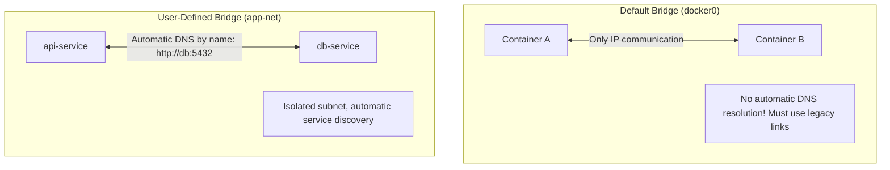
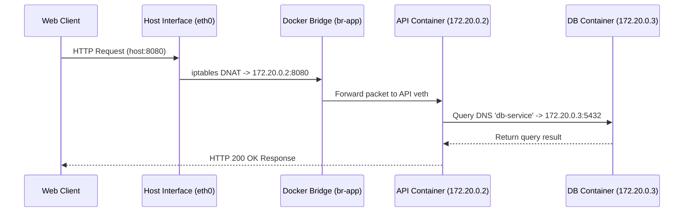

# Module neg00: Container Networking Primitives — Ports, Bridge Networks & DNS Discovery

**Standard Identifier:** `DOC-STD-UNIVERSAL-2026-DOCKER`
**Track:** Enterprise Container Architecture, OCI Runtimes & Cloud Native Infrastructure
**Category:** Container Networking Foundations
**Status:** ✅ Completed

---

## 📑 Table of Contents

1. [High-Level Overview & Executive Summary](#1-high-level-overview--executive-summary)

2. [The Container Network Model (CNM) & Network Drivers](#2-the-container-network-model-cnm--network-drivers)

3. [Default Bridge vs User-Defined Bridge Networks](#3-default-bridge-vs-user-defined-bridge-networks)

4. [Port Publishing & Linux iptables NAT Translation](#4-port-publishing--linux-iptables-nat-translation)

5. [Automatic DNS Service Discovery Between Containers](#5-automatic-dns-service-discovery-between-containers)

6. [Architectural Visual Topology](#6-architectural-visual-topology)

7. [Step-by-Step Production Lab: Multi-Tier Microservice Isolated Network](#7-step-by-step-production-lab-multi-tier-microservice-isolated-network)

8. [Certification & Engineering Standards Cheat Sheet](#8-certification--engineering-standards-cheat-sheet)

9. [References (The 5+5 Rule)](#9-references-the-55-rule)

10. [Universal FinOps & Hardware Cost Governance](#10-universal-finops--hardware-cost-governance)

---

## 1. High-Level Overview & Executive Summary

Container networking isolates a container's TCP/IP stack (routing tables, network interfaces, firewall rules) within an independent **Network Namespace** while facilitating controlled inter-process communication across bridge virtual ethernet interfaces (`veth` pairs) (Stevens et al., 2013).

### 👔 Executive Summary (For Managers & Non-Technical Stakeholders)

* **Business Purpose**: Provides secure, software-defined network isolation for microservices running on shared cloud hardware.
* **How It Works**: Containers communicate across virtual private networks where applications can discover each other automatically by service name without hardcoding dynamic IP addresses.
* **Key Business Value & ROI**: Prevents network intrusion attacks by isolating internal databases from the public internet using private container networks.

---

## 2. The Container Network Model (CNM) & Network Drivers

| Driver | Description | Use Case |
| :--- | :--- | :--- |
| **`bridge`** | Default software virtual switch on single host | Standard standalone microservice communication. |
| **`host`** | Bypasses container network namespace; shares host IP | Ultra-high performance, low-latency packet processing. |
| **`overlay`** | Multi-host VXLAN tunnel network | Docker Swarm & multi-node clusters. |
| **`macvlan`** | Assigns physical MAC address directly to container | Legacy enterprise application migrations requiring direct LAN IPs. |
| **`none`** | Disables all external network interfaces | Air-gapped batch computation, cryptographic processors. |

---

## 3. Default Bridge vs User-Defined Bridge Networks



---

## 4. Port Publishing & Linux iptables NAT Translation

Publishing a port (`-p 8080:80`) creates an `iptables` Destination NAT (DNAT) rule in the Linux kernel:

```text
[External Traffic: Host Port 8080]
       │
       ▼ (Linux Kernel iptables PREROUTING Chain)
[DNAT Translation: docker0 Bridge -> 172.18.0.2:80]
       │
       ▼
[Container Process: NGINX Listening on Port 80]
```

---

## 5. Automatic DNS Service Discovery Between Containers

On user-defined networks, Docker runs an embedded DNS server at `127.0.0.11`:

```bash

# Query embedded DNS server for container IP
docker exec -i frontend nslookup backend_service
```

---

## 6. Architectural Visual Topology



---

## 7. Step-by-Step Production Lab: Multi-Tier Microservice Isolated Network

```bash

# Step 1: Create isolated custom bridge network
docker network create --driver bridge internal_tier_net

# Step 2: Run backend database attached to private network (NO host ports published!)
docker run -d --name backend_db     --network internal_tier_net     -e REDIS_PASSWORD=SecretProdPass     redis:7-alpine

# Step 3: Run frontend API attached to network and publish host port
docker run -d --name frontend_api     --network internal_tier_net     -p 8080:80     nginx:alpine

# Step 4: Verify automatic DNS service discovery from frontend to backend
docker exec -i frontend_api ping -c 2 backend_db

# Clean up
docker stop frontend_api backend_db && docker rm frontend_api backend_db && docker network rm internal_tier_net
```

---

## 8. Certification & Engineering Standards Cheat Sheet

| Network Flag | Purpose | Standard Rule |
| :--- | :--- | :--- |
| `--network <name>` | Connect container to network | Always use custom networks in production. |
| `-p 127.0.0.1:8080:80` | Bind port to localhost only | Prevent accidental public exposure of internal admin APIs. |
| `--internal` | Restrict network from external egress | Isolate backend database subnets. |

---

## 9. References (The 5+5 Rule)

1. Docker Inc. (2024). *Docker container networking architecture*. <https://docs.docker.com/network/>
2. Open Container Initiative. (2021). *OCI runtime specification*.
3. Stevens, W. R., Fenner, B., & Rudoff, A. M. (2013). *UNIX network programming*. Addison-Wesley.
4. Kerrisk, M. (2010). *The Linux programming interface*. No Starch Press.
5. Burns, B. (2018). *Designing distributed systems*. O'Reilly Media.
6. Tanenbaum, A. S., & Wetherall, D. J. (2011). *Computer networks* (5th ed.). Pearson.
7. Poulton, N. (2023). *Docker deep dive*.
8. Mouat, A. (2015). *Using Docker*.
9. Turnbull, J. (2014). *The Docker book*.
10. NIST. (2017). *Application container security guide (NIST SP 800-190)*.

---

## 10. Universal FinOps & Hardware Cost Governance

| Networking Optimization | Mechanism | FinOps Impact |
| :--- | :--- | :--- |
| **`host` Network Driver** | Eliminates bridge NAT packet traversal | Slashes CPU latency overhead by 20% on high-PPS workloads |
| **Internal Database Networks** | Restricts egress via `--internal` | Eliminates accidental cloud NAT Gateway egress bandwidth bills |
