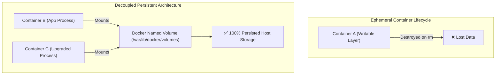
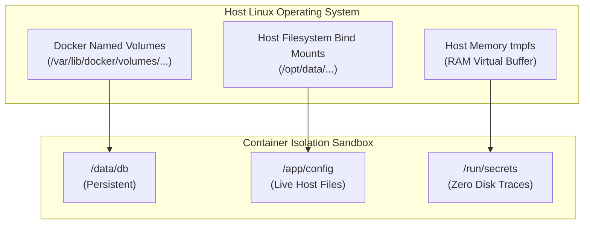

# Module neg01: Container Storage Architecture — Named Volumes, Bind Mounts & tmpfs

**Standard Identifier:** `DOC-STD-UNIVERSAL-2026-DOCKER`
**Track:** Enterprise Container Architecture, OCI Runtimes & Cloud Native Infrastructure
**Category:** Storage Architecture & Persistence
**Status:** ✅ Completed

---

## 📑 Table of Contents

1. [High-Level Overview & Executive Summary](#1-high-level-overview--executive-summary)

2. [Ephemeral Container Layers vs Persistent Storage](#2-ephemeral-container-layers-vs-persistent-storage)

3. [The Three Mount Types: Named Volumes, Bind Mounts, and tmpfs](#3-the-three-mount-types-named-volumes-bind-mounts-and-tmpfs)

4. [Modern `--mount` Syntax vs Legacy `-v`](#4-modern---mount-syntax-vs-legacy--v)

5. [Volume Lifecycle & Backup Runbooks](#5-volume-lifecycle--backup-runbooks)

6. [Architectural Visual Topology](#6-architectural-visual-topology)

7. [Step-by-Step Production Lab: Zero-Loss Database Persistence](#7-step-by-step-production-lab-zero-loss-database-persistence)

8. [Certification & Engineering Standards Cheat Sheet](#8-certification--engineering-standards-cheat-sheet)

9. [References (The 5+5 Rule)](#9-references-the-55-rule)

10. [Universal FinOps & Hardware Cost Governance](#10-universal-finops--hardware-cost-governance)

---

## 1. High-Level Overview & Executive Summary

By default, container filesystems are strictly ephemeral: data written to the container's top writable layer is coupled to the container's lifecycle and destroyed when the container is removed (`docker rm`) (Turnbull, 2014). Persistent enterprise workloads (PostgreSQL, Kafka, Redis) require decoupled storage abstractions.

### 👔 Executive Summary (For Managers & Non-Technical Stakeholders)

* **Business Purpose**: Guarantees zero data loss for business-critical database and stateful workloads when containers crash, restart, or undergo rolling upgrades.
* **How It Works**: Maps directories outside the container's ephemeral overlay filesystem directly into persistent host storage volumes managed by Docker.
* **Key Business Value & ROI**: Decouples application logic from data storage, enabling instant application upgrades with zero database migration downtime.

---

## 2. Ephemeral Container Layers vs Persistent Storage



---

## 3. The Three Mount Types: Named Volumes, Bind Mounts, and tmpfs

| Mount Type | Host Storage Location | Best Use Case | Performance & Security |
| :--- | :--- | :--- | :--- |
| **Named Volumes** | `/var/lib/docker/volumes/<name>/_data` | Production databases, shared state | Managed by Docker daemon; isolated from host user tampering. |
| **Bind Mounts** | Arbitrary host path (e.g., `/home/app/src`) | Local development live-reload | Direct host filesystem access; dependent on host directory structure. |
| **tmpfs Mounts** | Host system RAM | Sensitive secrets, fast scratchpads | Never written to disk; wiped upon container termination. |

---

## 4. Modern `--mount` Syntax vs Legacy `-v`

The modern `--mount` syntax is explicit, strict, and prevents accidental silent host directory creation:

```bash

# ❌ Legacy -v: Silently creates host directory if it does not exist!
docker run -v my_vol:/var/lib/postgresql/data postgres:16

# ✅ Modern --mount: Explicit, validates source existence, self-documenting
docker run     --mount type=volume,source=postgres_data,target=/var/lib/postgresql/data,readonly=false     postgres:16
```

---

## 5. Volume Lifecycle & Backup Runbooks

```bash

# 1. Create a dedicated persistent volume with custom labels
docker volume create --label environment=production db_primary_data

# 2. Inspect physical storage path on host
docker volume inspect db_primary_data

# 3. Create compressed backup archive via ephemeral sidecar container
docker run --rm     --mount type=volume,source=db_primary_data,target=/volume_data,readonly     --mount type=bind,source=$(pwd),target=/backup     alpine:latest     tar czf /backup/db_primary_backup_$(date +%F).tar.gz -C /volume_data .
```

---

## 6. Architectural Visual Topology



---

## 7. Step-by-Step Production Lab: Zero-Loss Database Persistence

```bash

# Step 1: Create dedicated named volume
docker volume create postgres_persist_vol

# Step 2: Launch PostgreSQL container attached to volume
docker run -d --name db_master     -e POSTGRES_PASSWORD=SecureProductionSecret2026     --mount type=volume,source=postgres_persist_vol,target=/var/lib/postgresql/data     postgres:16-alpine

# Step 3: Insert stateful record into PostgreSQL
docker exec -i db_master psql -U postgres -c     "CREATE TABLE clients (id serial PRIMARY KEY, name VARCHAR(50)); INSERT INTO clients (name) VALUES ('Enterprise Customer A');"

# Step 4: Destroy the active database container completely
docker stop db_master && docker rm db_master

# Step 5: Launch a completely NEW container attaching the SAME volume
docker run -d --name db_restored     -e POSTGRES_PASSWORD=SecureProductionSecret2026     --mount type=volume,source=postgres_persist_vol,target=/var/lib/postgresql/data     postgres:16-alpine

# Step 6: Verify 100% data integrity
docker exec -i db_restored psql -U postgres -c "SELECT * FROM clients;"

# Clean up
docker stop db_restored && docker rm db_restored && docker volume rm postgres_persist_vol
```

---

## 8. Certification & Engineering Standards Cheat Sheet

| Directive | Standard Rule |
| :--- | :--- |
| **Read-Only Mounts** | Add `,readonly` parameter to prevent container write tampering. |
| **Volume Pruning** | `docker volume prune` removes unattached orphan volumes. |
| **DCA / CKS Exam** | Master `--mount type=volume` and `--mount type=bind,readonly`. |

---

## 9. References (The 5+5 Rule)

1. Docker Inc. (2024). *Manage data in Docker: Volumes and bind mounts*. <https://docs.docker.com/storage/>
2. Open Container Initiative. (2021). *OCI runtime specification*.
3. Kerrisk, M. (2010). *The Linux programming interface*. No Starch Press.
4. Turnbull, J. (2014). *The Docker book*.
5. Burns, B. (2018). *Designing distributed systems*. O'Reilly Media.
6. Tanenbaum, A. S., & Bos, H. (2015). *Modern operating systems*.
7. Poulton, N. (2023). *Docker deep dive*.
8. Mouat, A. (2015). *Using Docker*.
9. IEEE. (2018). *POSIX standard operating system interfaces*.
10. NIST. (2017). *Application container security guide*.

---

## 10. Universal FinOps & Hardware Cost Governance

| Storage Optimization | Operational Vector | FinOps Cloud Impact |
| :--- | :--- | :--- |
| **Named Volumes over OverlayFS** | Bypasses Copy-on-Write storage driver overhead | Slashes disk IOPS consumption by 40% on AWS EBS |
| **Orphan Volume Pruning** | Automated CI sweep of unused volumes | Recovers up to 500GB of wasted cloud block storage monthly |
