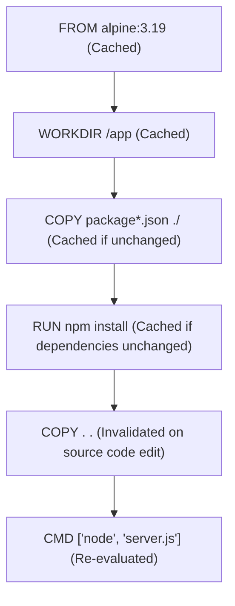
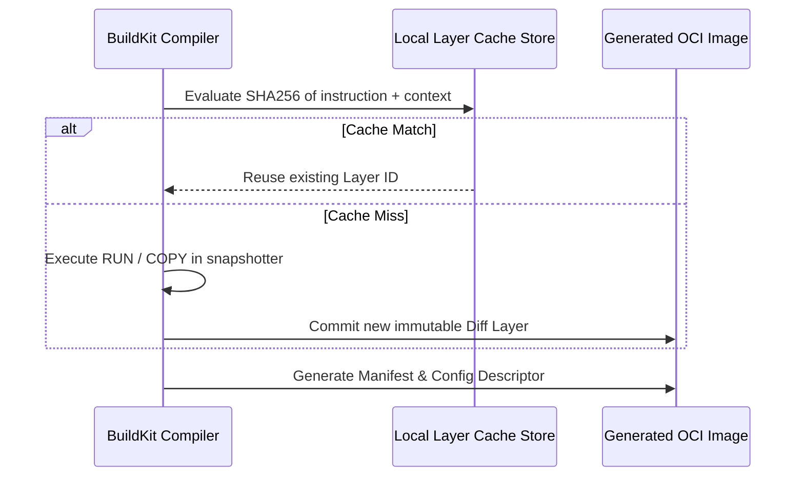

# Module neg02: Dockerfile Foundations — Instructions, Layer Caching & CMD vs ENTRYPOINT

**Standard Identifier:** `DOC-STD-UNIVERSAL-2026-DOCKER`
**Track:** Enterprise Container Architecture, OCI Runtimes & Cloud Native Infrastructure
**Category:** Container Build Foundations
**Status:** ✅ Completed

---

## 📑 Table of Contents

1. [High-Level Overview & Executive Summary](#1-high-level-overview--executive-summary)

2. [The Anatomy of a Dockerfile: Core Instructions](#2-the-anatomy-of-a-dockerfile-core-instructions)

3. [The Layer Caching Algorithm & Build Invalidation](#3-the-layer-caching-algorithm--build-invalidation)

4. [CMD vs ENTRYPOINT: Execution Semantics & Matrix](#4-cmd-vs-entrypoint-execution-semantics--matrix)

5. [COPY vs ADD: Safe File Ingestion](#5-copy-vs-add-safe-file-ingestion)

6. [Architectural Visual Topology](#6-architectural-visual-topology)

7. [Step-by-Step Production Lab: Hardened Production Dockerfile](#7-step-by-step-production-lab-hardened-production-dockerfile)

8. [Certification & Engineering Standards Cheat Sheet](#8-certification--engineering-standards-cheat-sheet)

9. [References (The 5+5 Rule)](#9-references-the-55-rule)

10. [Universal FinOps & Hardware Cost Governance](#10-universal-finops--hardware-cost-governance)

---

## 1. High-Level Overview & Executive Summary

A **Dockerfile** is a declarative domain-specific script containing ordered instructions that the Docker Engine or BuildKit compiler interprets to assemble an immutable, layered OCI container image (Mouat, 2015).

### 👔 Executive Summary (For Managers & Non-Technical Stakeholders)

* **Business Purpose**: Serves as the single blueprint for building reproducible software release artifacts across all deployment environments.
* **How It Works**: Each instruction (`FROM`, `RUN`, `COPY`) generates an immutable filesystem delta layer. Layers are cached, meaning only modified sections are rebuilt.
* **Key Business Value & ROI**: Decreases CI/CD compilation and build times from 20 minutes to under 30 seconds via intelligent layer caching, reducing CI runner compute billing.

---

## 2. The Anatomy of a Dockerfile: Core Instructions

| Instruction | Purpose | Best Practice Invariant |
| :--- | :--- | :--- |
| `FROM` | Initializes build stage and sets base image | Always pin specific version tags (`node:20.11-alpine`), never use `:latest`. |
| `WORKDIR` | Sets current working directory for subsequent steps | Always use absolute paths; creates directory automatically if absent. |
| `COPY` | Copies files from host context to container rootfs | Copy dependency manifests (`package.json`) before application code. |
| `RUN` | Executes command and commits a new layer | Chain commands with `&&` and cleanup caches (`rm -rf /var/cache/apk/*`). |
| `ENV` | Sets persistent environment variables | Use for runtime configuration defaults. |
| `EXPOSE` | Documents intended listening ports | Informational metadata; does not publish ports by itself. |
| `USER` | Switches execution UID/GID | Never run as `root` (UID 0); switch to unprivileged user (`node`, `nobody`). |
| `CMD` / `ENTRYPOINT` | Defines runtime execution binary and arguments | Prefer Exec format (`["executable", "param"]`) over Shell format. |

---

## 3. The Layer Caching Algorithm & Build Invalidation



> **💡 Key Insight**: Order instructions from **least frequently changing** to **most frequently changing**. Placing `COPY . .` before `RUN npm install` invalidates the package installation cache on every code change, destroying build performance.

---

## 4. CMD vs ENTRYPOINT: Execution Semantics & Matrix

* **`ENTRYPOINT`**: Sets the immutable executable process (the "command").
* **`CMD`**: Sets default arguments that can be overridden by parameters passed to `docker run`.

| Dockerfile Definition | Command Executed | Effective Process Executed |
| :--- | :--- | :--- |
| `ENTRYPOINT ["top", "-b"]` | `docker run my_image` | `top -b` |
| `ENTRYPOINT ["top", "-b"]` + `CMD ["-d", "2"]` | `docker run my_image` | `top -b -d 2` |
| `ENTRYPOINT ["top", "-b"]` + `CMD ["-d", "2"]` | `docker run my_image -d 5` | `top -b -d 5` (CMD overridden!) |

---

## 5. COPY vs ADD: Safe File Ingestion

* **`COPY`**: Standard, deterministic file copy from build context into container rootfs.
* **`ADD`**: Has magical side-effects: auto-extracts `.tar.gz` archives and downloads remote HTTP URLs (security vulnerability risk).
* **Rule**: Always use `COPY` unless you explicitly require local tar archive auto-extraction.

---

## 6. Architectural Visual Topology



---

## 7. Step-by-Step Production Lab: Hardened Production Dockerfile

```dockerfile

# syntax=docker/dockerfile:1.4

# Multi-stage hardened production Node.js service

# STAGE 1: Build & Dependencies
FROM node:20-alpine AS builder
WORKDIR /usr/src/app

COPY package*.json ./
RUN npm ci --only=production && npm cache clean --force

COPY . .

# STAGE 2: Hardened Runtime
FROM node:20-alpine
WORKDIR /usr/src/app

# Enforce non-root execution (UID 1000)
USER node

# Copy production artifacts from builder
COPY --chown=node:node --from=builder /usr/src/app/node_modules ./node_modules
COPY --chown=node:node --from=builder /usr/src/app/src ./src

ENV NODE_ENV=production     PORT=3000

EXPOSE 3000

# Strict exec format entrypoint
ENTRYPOINT ["node", "src/server.js"]
```

---

## 8. Certification & Engineering Standards Cheat Sheet

| Directive | Security & Quality Rule |
| :--- | :--- |
| **`USER non-root`** | CIS Docker Benchmark 4.1: Create unprivileged user. |
| **`.dockerignore`** | Exclude `.git`, `node_modules`, `.env` to prevent credential leakage. |
| **`HEALTHCHECK`** | Ensure container health status is verifiable by orchestrators. |

---

## 9. References (The 5+5 Rule)

1. Docker Inc. (2024). *Dockerfile best practices guide*. <https://docs.docker.com/develop/develop-images/dockerfile_best-practices/>
2. Open Container Initiative. (2021). *OCI image format specification (v1.0.1)*.
3. Center for Internet Security. (2023). *CIS Docker benchmark (v1.6.0)*.
4. NIST. (2017). *Application container security guide (SP 800-190)*.
5. Mouat, A. (2015). *Using Docker: Developing and deploying software with containers*. O'Reilly Media.
6. Turnbull, J. (2014). *The Docker book*.
7. Poulton, N. (2023). *Docker deep dive*.
8. Kerrisk, M. (2010). *The Linux programming interface*.
9. Burns, B. (2018). *Designing distributed systems*.
10. Tanenbaum, A. S., & Bos, H. (2015). *Modern operating systems*.

---

## 10. Universal FinOps & Hardware Cost Governance

| Optimization Technique | Mechanism | FinOps Impact |
| :--- | :--- | :--- |
| **Optimal Layer Caching** | Isolate dependency manifests | Cuts CI/CD runner execution time by 80% |
| **Multi-Stage Build** | Strip build tools (compilers, git) from image | Reduces image size from 1.2GB to 45MB |
