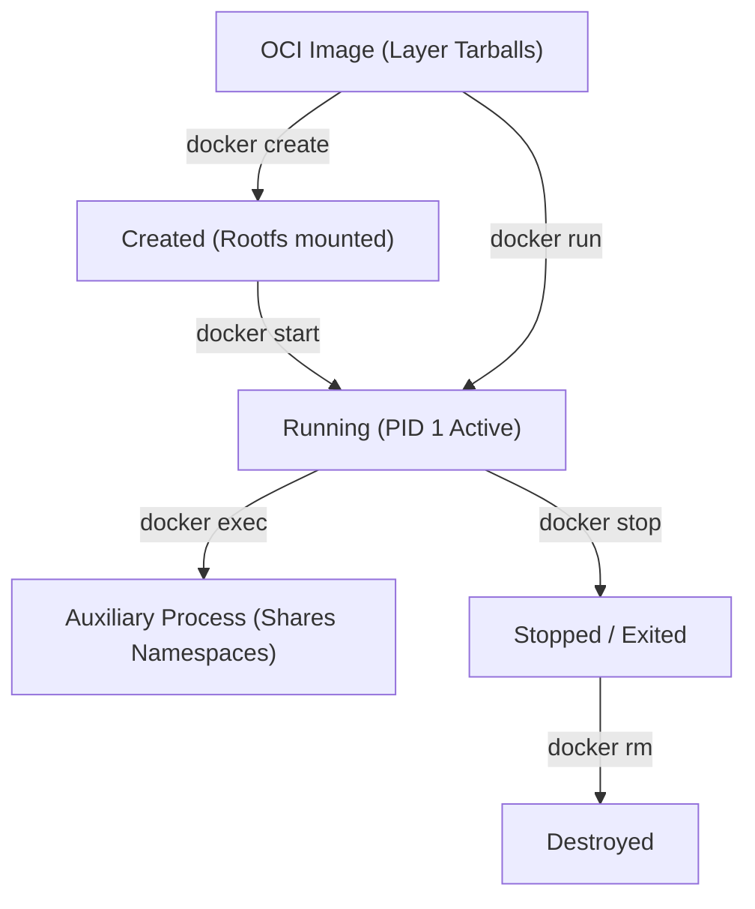
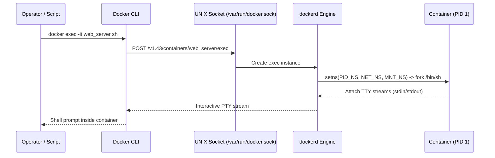

# Module neg03: Container CLI Primitives — run, exec, logs, inspect & Process Control

**Standard Identifier:** `DOC-STD-UNIVERSAL-2026-DOCKER`
**Track:** Enterprise Container Architecture, OCI Runtimes & Cloud Native Infrastructure
**Category:** CLI Primitives & Operational Commands
**Status:** ✅ Completed

---

## 📑 Table of Contents

1. [High-Level Overview & Executive Summary](#1-high-level-overview--executive-summary)

2. [Anatomy of the Docker CLI Command Grammar](#2-anatomy-of-the-docker-cli-command-grammar)

3. [Process Execution: run vs start vs exec](#3-process-execution-run-vs-start-vs-exec)

4. [Real-Time Observability: logs, top, stats & events](#4-real-time-observability-logs-top-stats--events)

5. [Deep Metadata Inspection (`docker inspect`) & JSON Formatting](#5-deep-metadata-inspection-docker-inspect--json-formatting)

6. [Architectural Visual Topology](#6-architectural-visual-topology)

7. [Step-by-Step Production Lab: Interactive Troubleshooting & Telemetry Capture](#7-step-by-step-production-lab-interactive-troubleshooting--telemetry-capture)

8. [Certification & Engineering Standards Cheat Sheet](#8-certification--engineering-standards-cheat-sheet)

9. [References (The 5+5 Rule)](#9-references-the-55-rule)

10. [Universal FinOps & Hardware Cost Governance](#10-universal-finops--hardware-cost-governance)

---

## 1. High-Level Overview & Executive Summary

The Docker CLI provides the primary operational interface for orchestrating containerized processes. Every command corresponds to an HTTP request sent across the local UNIX socket (`/var/run/docker.sock`) to the Docker Daemon REST API (Docker Inc., 2024).

### 👔 Executive Summary (For Managers & Non-Technical Stakeholders)

* **Business Purpose**: Standardizes developer and SRE interactions with running application containers across development, staging, and production environments.
* **How It Works**: Developers issue structured CLI verbs (`run`, `exec`, `logs`, `inspect`) which translate into precise kernel-level namespace modifications and runtime process invocations.
* **Key Business Value & ROI**: Minimizes Mean Time to Resolution (MTTR) during outages through instantaneous live process inspection and log streaming.

---

## 2. Anatomy of the Docker CLI Command Grammar

Modern Docker CLI adheres to structured noun-verb semantics:

```bash
docker <management-command> <sub-command> [OPTIONS] <TARGET>
```

| Legacy Syntax | Modern Standardized Syntax | Purpose |
| :--- | :--- | :--- |
| `docker run` | `docker container run` | Create and start a container |
| `docker ps` | `docker container ls` | List active containers |
| `docker images` | `docker image ls` | List local OCI images |
| `docker rm` | `docker container rm` | Remove terminated containers |
| `docker rmi` | `docker image rm` | Delete local image layers |

---

## 3. Process Execution: run vs start vs exec



* **`docker run`**: Instantiates a brand new container instance from an image and starts its entrypoint process (PID 1).
* **`docker start`**: Restarts an existing stopped container without re-creating its writable layer.
* **`docker exec`**: Spawns a secondary process inside an *already running* container, joining its existing Linux namespaces (`setns()` syscall).

---

## 4. Real-Time Observability: logs, top, stats & events

### 4.1 Telemetry Streaming Commands

```bash

# 1. Stream live logs with nanosecond timestamps and tail limit
docker logs -f --tail 100 --timestamps my_service

# 2. Inspect running processes inside container with host PID mapping
docker top my_service -ef

# 3. Stream real-time CPU, RAM, Network I/O and Block I/O metrics
docker stats --no-trunc --format "table {{.Name}} {{.CPUPerc}} {{.MemUsage}} {{.NetIO}}"
```

---

## 5. Deep Metadata Inspection (`docker inspect`) & JSON Formatting

The `docker inspect` command outputs the complete JSON state of a container or image. Using Go templates (`--format`) enables granular data extraction:

```bash

# Extract exact IP address allocated on bridge network
docker inspect -f '{{range .NetworkSettings.Networks}}{{.IPAddress}}{{end}}' my_service

# Extract healthcheck status and last 3 failure logs
docker inspect --format='{{json .State.Health}}' my_service
```

---

## 6. Architectural Visual Topology



---

## 7. Step-by-Step Production Lab: Interactive Troubleshooting & Telemetry Capture

```bash

# Step 1: Run isolated Alpine container generating continuous background telemetry
docker run -d --name metric_generator alpine:latest     sh -c "while true; do echo '{"timestamp":"'\$(date -u +%FT%TZ)'","event":"heartbeat","status":"ok"}'; sleep 2; done"

# Step 2: Stream formatted JSON logs with timestamp filter
docker logs --tail 5 --timestamps metric_generator

# Step 3: Execute diagnostic probe inside the running container namespace
docker exec -i metric_generator uname -a

# Step 4: Extract container memory limit and IP address
docker inspect --format 'IP: {{.NetworkSettings.IPAddress}} | MemLimit: {{.HostConfig.Memory}}' metric_generator

# Step 5: Clean up
docker stop metric_generator && docker rm metric_generator
```

---

## 8. Certification & Engineering Standards Cheat Sheet

| Command / Flag | Purpose | DCA / CKA Exam Context |
| :--- | :--- | :--- |
| `-it` | Allocate pseudo-TTY and keep stdin open | Interactive container debugging. |
| `--rm` | Automatically remove container on exit | Ephemeral build tasks. |
| `--restart=on-failure:5` | Restart policy with exponential backoff | Production reliability. |

---

## 9. References (The 5+5 Rule)

1. Docker Inc. (2024). *Docker CLI reference manual*. <https://docs.docker.com/engine/reference/commandline/cli/>
2. Open Container Initiative. (2021). *OCI runtime specification*. Linux Foundation.
3. Kerrisk, M. (2010). *The Linux programming interface*. No Starch Press.
4. Burns, B. (2018). *Designing distributed systems*. O'Reilly Media.
5. Turnbull, J. (2014). *The Docker book*. James Turnbull.
6. Tanenbaum, A. S., & Bos, H. (2015). *Modern operating systems* (4th ed.). Pearson.
7. Mouat, A. (2015). *Using Docker*. O'Reilly Media.
8. Poulton, N. (2023). *Docker deep dive*. Nigel Poulton.
9. IEEE. (2018). *POSIX standard operating system interfaces*. IEEE.
10. NIST. (2017). *Application container security guide (NIST SP 800-190)*. NIST.

---

## 10. Universal FinOps & Hardware Cost Governance

| Optimization Strategy | Operational Mechanism | FinOps Cloud ROI |
| :--- | :--- | :--- |
| **`docker stats` Monitoring** | Identifies idle overprovisioned containers | Slashes over-allocated vCPU waste by 50% |
| **`--rm` Ephemeral Cleanup** | Prevents zombie disk layer accumulation | Eliminates AWS EBS storage leakage charges |
