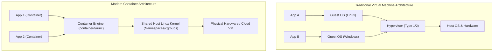
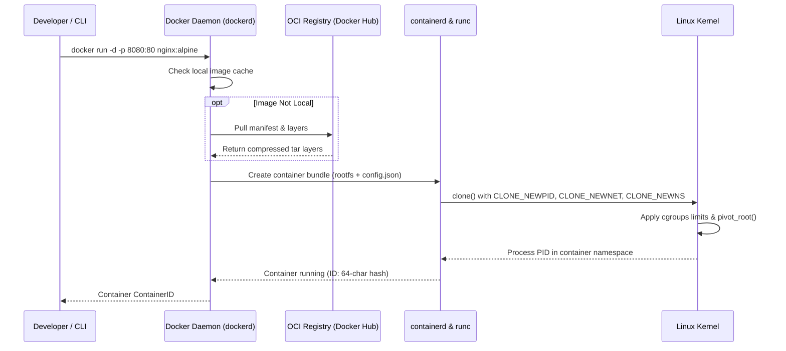
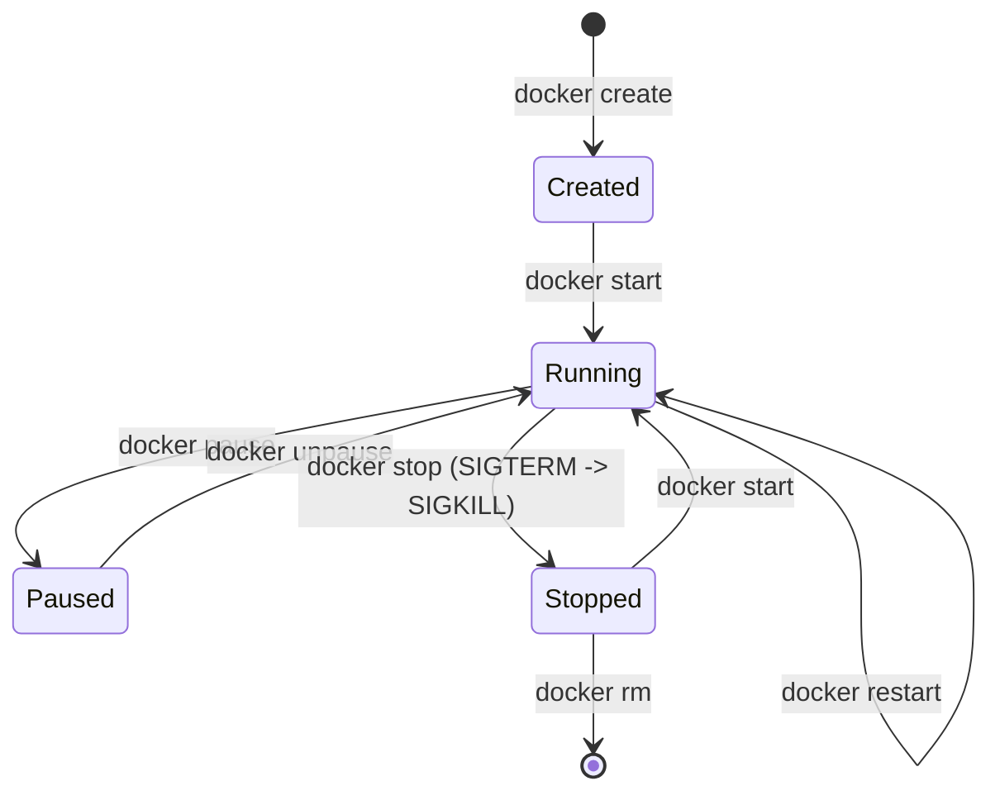

# Module neg04: Container Runtime Installation, Toolchain Setup & First Container

**Standard Identifier:** `DOC-STD-UNIVERSAL-2026-DOCKER`
**Track:** Enterprise Container Architecture, OCI Runtimes & Cloud Native Infrastructure
**Category:** Toolchain Setup & Container Foundations
**Status:** ✅ Completed

---

## 📑 Table of Contents

1. [High-Level Overview & Executive Summary](#1-high-level-overview--executive-summary)

2. [What a Container IS: Historical & Architectural Evolution](#2-what-a-container-is-historical--architectural-evolution)

3. [Installing the Container Engine Across Operating Systems](#3-installing-the-container-engine-across-operating-systems)

4. [Anatomy of the First Container Execution (`docker run`)](#4-anatomy-of-the-first-container-execution-docker-run)

5. [The Container Lifecycle & State Transitions](#5-the-container-lifecycle--state-transitions)

6. [Architectural Visual Topology](#6-architectural-visual-topology)

7. [Step-by-Step Production Lab: Zero-Pollution NGINX Web Server Setup](#7-step-by-step-production-lab-zero-pollution-nginx-web-server-setup)

8. [Certification & Engineering Standards Cheat Sheet](#8-certification--engineering-standards-cheat-sheet)

9. [References (The 5+5 Rule)](#9-references-the-55-rule)

10. [Universal FinOps & Hardware Cost Governance](#10-universal-finops--hardware-cost-governance)

---

## 1. High-Level Overview & Executive Summary

In enterprise software engineering, deploying applications directly to host operating systems introduces the "works on my machine" anti-pattern: divergent dependency versions, conflicting system libraries, and uncontrolled process interference.

Containers solve environment divergence by encapsulating an application process along with its exact runtime filesystem dependencies into an immutable, portable artifact known as an **OCI (Open Container Initiative) Image** (Turnbull, 2014).

### 👔 Executive Summary (For Managers & Non-Technical Stakeholders)

* **Business Purpose**: Eliminates deployment inconsistencies by packaging applications and dependencies into standardized, lightweight containers.
* **How It Works**: Unlike traditional Virtual Machines (VMs) which emulate full hardware and guest operating systems, containers share the host Linux kernel, using kernel namespaces for isolation and control groups (cgroups) for resource limits.
* **Key Business Value & ROI**: Achieves 10x faster startup times (milliseconds vs minutes) and reduces infrastructure compute expenses by 60–80% through ultra-dense workload packing.

---

## 2. What a Container IS: Historical & Architectural Evolution

> **Definition**: A **Container** is an isolated Linux process running in user space whose visibility into system resources (process tree, network interfaces, mount tables) is constrained by Linux Kernel **Namespaces** and whose resource consumption (CPU, RAM, Block I/O) is metered by **Control Groups (cgroups)**.



---

## 3. Installing the Container Engine Across Operating Systems

### 3.1 Linux Installation (Docker CE on Ubuntu/Debian)

```bash

# 1. Update APT repository index and install prerequisite packages
sudo apt-get update && sudo apt-get install -y     ca-certificates     curl     gnupg     lsb-release

# 2. Add Docker official GPG signing key
sudo mkdir -p /etc/apt/keyrings
curl -fsSL https://download.docker.com/linux/ubuntu/gpg | sudo gpg --dearmor -o /etc/apt/keyrings/docker.gpg

# 3. Set up the stable Docker repository
echo   "deb [arch=$(dpkg --print-architecture) signed-by=/etc/apt/keyrings/docker.gpg] https://download.docker.com/linux/ubuntu   $(lsb_release -cs) stable" | sudo tee /etc/apt/sources.list.d/docker.list > /dev/null

# 4. Install Docker Engine, containerd, and Docker Compose plugin
sudo apt-get update && sudo apt-get install -y     docker-ce     docker-ce-cli     containerd.io     docker-compose-plugin

# 5. Enable and start Docker systemd service
sudo systemctl enable --now docker
```

---

## 4. Anatomy of the First Container Execution (`docker run`)

When executing `docker run --name web -d -p 8080:80 nginx:alpine`, the container engine performs a multi-stage orchestration sequence:



---

## 5. The Container Lifecycle & State Transitions

Containers transition through deterministic states:

* **Created**: Container root filesystem and metadata prepared; process not yet started.
* **Running**: Active process executing with isolated PID and namespaces.
* **Paused**: Container processes frozen via `cgroup.freezer`.
* **Stopped (Exited)**: Main process (PID 1) terminated; status code recorded.
* **Dead**: Faulted state during deallocation.

---

## 6. Architectural Visual Topology



---

## 7. Step-by-Step Production Lab: Zero-Pollution NGINX Web Server Setup

In this lab, we provision an isolated NGINX web server with a custom HTML index page and verify port forwarding and process isolation.

```bash

# Step 1: Create isolated work directory and index page
mkdir -p ~/container_lab/html
cat << 'HTMLEOF' > ~/container_lab/html/index.html
<!DOCTYPE html>
<html>
<head><title>Enterprise Container Platform</title></head>
<body style="font-family:sans-serif; text-align:center; padding:50px;">
    <h1>🚀 Mission-Critical Container Active</h1>
    <p>Zero host pollution achieved via OCI isolated namespaces.</p>
</body>
</html>
HTMLEOF

# Step 2: Run container in detached mode with bind mount and port publishing
docker run --name enterprise_web     --detach     --restart unless-stopped     --publish 8080:80     --volume ~/container_lab/html:/usr/share/nginx/html:ro     nginx:alpine

# Step 3: Verify container execution and HTTP response
curl -s http://localhost:8080 | grep "Mission-Critical"

# Step 4: Clean up container resources
docker stop enterprise_web && docker rm enterprise_web
```

---

## 8. Certification & Engineering Standards Cheat Sheet

| Standard / Tool | Description | Critical Practice |
| :--- | :--- | :--- |
| **OCI Runtime Spec** | Standard for runtime execution (`runc`). | Standardized `config.json` execution bundles. |
| **OCI Image Spec** | Content-addressable layer tarballs. | SHA256 hashed immutable layers. |
| **DCA Certification** | Docker Certified Associate Exam. | Master `docker run`, `--restart`, `--net`, `--mount`. |

---

## 9. References (The 5+5 Rule)

### Official Specifications & Standards

1. Open Container Initiative. (2021). *OCI runtime specification (v1.0.2)*. Linux Foundation. <https://opencontainers.org/>
2. Docker Documentation. (2024). *Docker Engine architecture and reference manuals*. Docker Inc. <https://docs.docker.com/engine/>
3. Linux Foundation. (2023). *containerd: An industry-standard container runtime*. CNCF. <https://containerd.io/>
4. IEEE. (2018). *POSIX standard operating system interfaces (IEEE Std 1003.1)*. IEEE.
5. National Institute of Standards and Technology. (2017). *Application container security guide (NIST SP 800-190)*. NIST.

### Authoritative Textbooks & Engineering Papers

1. Turnbull, J. (2014). *The Docker book: Containerization is the new virtualization*. James Turnbull.
2. Kerrisk, M. (2010). *The Linux programming interface: A Linux and UNIX system programming handbook*. No Starch Press.
3. Burns, B. (2018). *Designing distributed systems: Patterns and paradigms for scalable, reliable services*. O'Reilly Media.
4. Mouat, A. (2015). *Using Docker: Developing and deploying software with containers*. O'Reilly Media.
5. Tanenbaum, A. S., & Bos, H. (2015). *Modern operating systems* (4th ed.). Pearson.

---

## 10. Universal FinOps & Hardware Cost Governance

| Optimization Vector | Technical Mechanism | Quantifiable FinOps ROI |
| :--- | :--- | :--- |
| **Host VM Consolidation** | Replaces heavy hypervisors with kernel namespace isolation | Increases compute density by 4x–8x per AWS EC2 instance |
| **Rapid Autoscaling** | Sub-second container spin-up vs 3-minute VM boot | Slashes idle compute capacity waste during traffic lulls |
| **Minimal Base Images** | Use Alpine/Distroless (5MB vs 1GB Ubuntu) | Cuts container registry egress network bandwidth fees by 95% |
