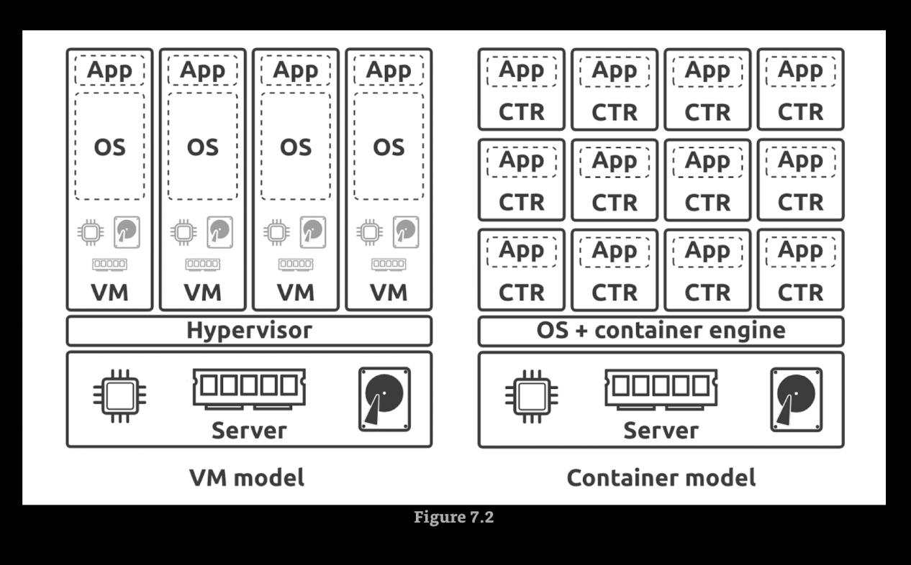
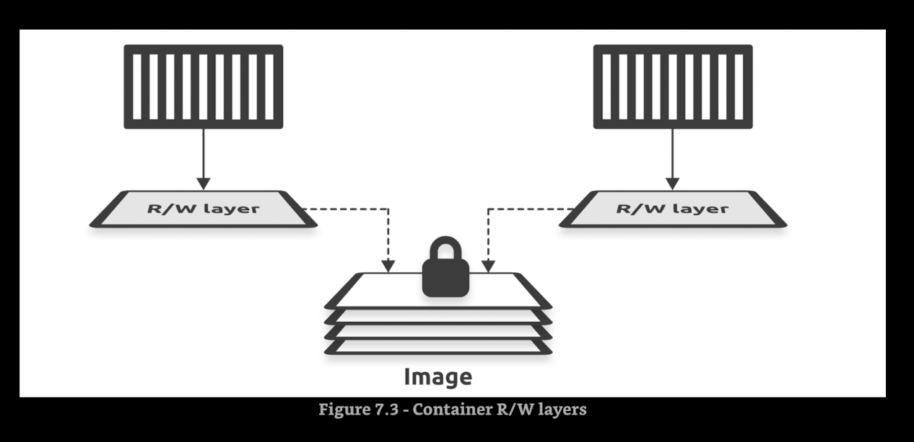

# Working with containers

* To install nano inside gcc:latest docker container `apt-get update && apt-get install nano -y`

## VMs vs Containers



## Images and containers

* You can start multiple containers from a single image. Images are read-only, but every container has a read-write layer. 



## Pulling image and start container

```bash
docker pull nginx:latest
docker run -it -d --name dashboard --publish 80:80 nginx:latest
docker exec -it dashboard sh
cd /usr/share/nginx/html
```

## Docker commands

* `docker build -t demoapp:latest .`
* `docker run -d --name macorina --publish 8000:8000 demoapp:latest`
* `docker exec -it macorina sh`
* `docker pull python:latest`
* `docker run -it -d --name macarena python:latest`
* `docker exec -u root -it macarena sh`