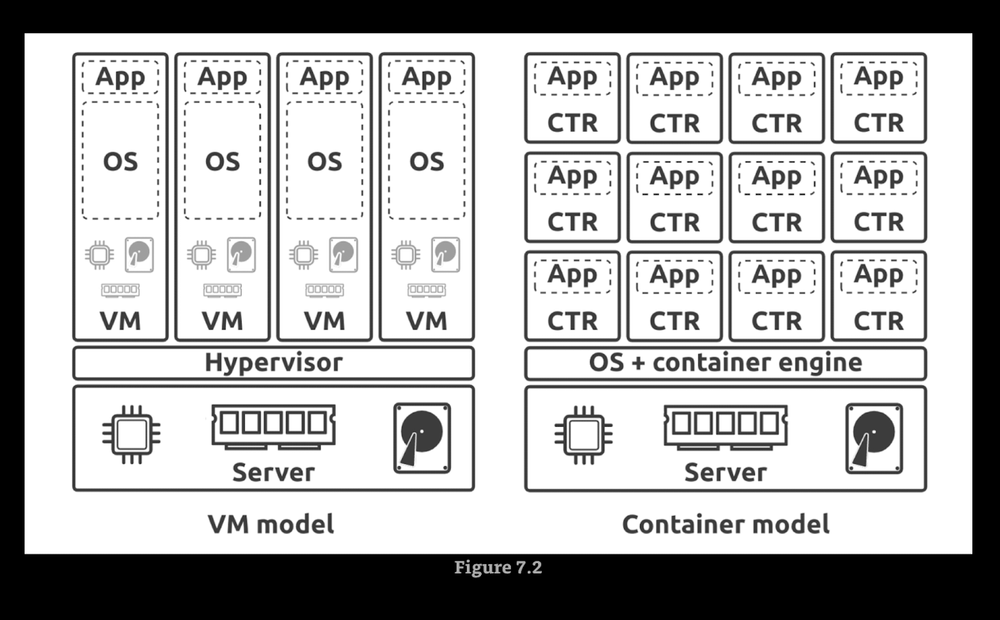
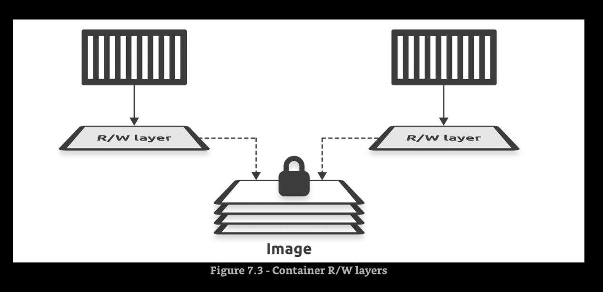

# Module: Working with Containers & Lifecycle Management
**Category:** Container Operations & Process Management
**Status:** ✅ Completed

---

## 1. High-Level Overview
Container lifecycle management encompasses the creation, execution, monitoring, resource adjustment, pause/resume, and graceful termination of containerized processes. A Docker container progresses through well-defined lifecycle states: `created`, `running`, `paused`, `restarting`, `removing`, and `exited`. Mastery of container operations requires deep familiarity with resource constraint flags (`--cpus`, `--memory`, `--pids-limit`), interactive execution (`docker exec`), container restart policies, and ephemeral debugging techniques.

### 👔 Executive Summary (For Managers & Non-Technical Stakeholders)
* **Business Purpose**: Provides site reliability engineers with complete operational control to monitor, troubleshoot, restart, and scale application workloads running across enterprise servers.
* **How It Works**: Allows operators to securely inspect live applications, adjust server memory/CPU limits in real time, view diagnostic logs, and restart crashed services automatically.
* **Key Business Value & Use Cases**: Drastically reduces Mean Time to Recovery (MTTR) during system incidents, prevents runaway memory leaks from crashing shared server hardware, and guarantees 24/7 self-healing availability.

---

## 2. Container Lifecycle States & Restart Policies

```
+-----------+    docker run / start     +-----------+
|  Created  | ------------------------> |  Running  |
+-----------+                           +-----------+
      ^                                    |     |
      | docker create                      |     | docker pause
      |                                    |     v
+-----------+                              |  +-----------+
|   Image   |                              |  |  Paused   |
+-----------+                              |  +-----------+
                                           |     | docker unpause
                                           v     v
                                        +-----------+
                                        |  Exited   |
                                        +-----------+
```

### Restart Policies:
- `no`: Do not restart the container automatically (default).
- `on-failure[:max-retries]`: Restart only if the container exits with a non-zero exit code.
- `always`: Always restart the container regardless of exit code or daemon restart.
- `unless-stopped`: Always restart the container unless explicitly stopped by an administrator.

---

## 📌 Architecture, Diagrams & Execution Mechanics (Original Notes)

### Virtual Machines vs Containers Comparison



### Images and Containers (Read-Write Thin Layer)
Multiple isolated containers can be instantiated from a single read-only image. Every container receives a dedicated thin read-write storage layer.



### How Containers Start Applications
There are three ways to configure application startup:
1. An `ENTRYPOINT` instruction defined in the image Dockerfile.
2. A `CMD` instruction defined in the image Dockerfile.
3. Overriding arguments passed via the CLI (`docker run <image> <command>`).

### Connecting to a Running Container
* **Interactive Mode**: `-it` (allocates a pseudo-TTY and keeps stdin open).
* **Remote Execution**: `docker exec -it <container> <command>`.
* **Root Override**: `docker exec -u root -it <container> sh`.

### Interactive Debugging & Maintenance Snippets
* Pull and start dashboard web container:
```bash
docker pull nginx:latest
docker run -it -d \
    --name dashboard \
    --publish 80:80 \
    nginx:latest
docker exec -it dashboard sh
```
* Run background FastAPI application with environment file:
```bash
docker run -it --detach \
    --name bang \
    --publish 8000:8000 \
    --env-file .env \
    fastapi:latest
```
* Self-healing Alpine container:
```bash
docker run --name neversaydie -it \
    --restart always \
    alpine sh
```
* Purge all stopped containers and untagged images:
```bash
docker rm $(docker ps -aq) -f
docker rmi $(docker images -q)
```

---

## 3. Hands-On Walkthrough: Resource Limits & Interactive Troubleshooting
### Step 1: Launch a Container with Memory Limits and Restart Policy
Deploy an Nginx container with automatic restart and 128MB RAM limit:
```bash
docker run -d \
    --name resilient-web \
    --restart=unless-stopped \
    --memory="128m" \
    --pids-limit=100 \
    -p 8081:80 \
    nginx:alpine
```

### Step 2: Execute an Interactive Command Inside Running Container
Open a shell session inside the container:
```bash
docker exec -it resilient-web sh -c "nginx -v"
```

### Step 3: Inspect Container Exit Code and Health
Query container exit state and restart count:
```bash
docker inspect resilient-web \
    --format '{{.State.Status}} (Restarts: {{.RestartCount}})'
```

---

## 4. Pure CLI Commands
### 1. Filter and List Running Containers with Formatted Output
Display running containers with ID, names, and status:
```bash
docker ps \
    --format "table {{.ID}}\t{{.Names}}\t{{.Status}}\t{{.Ports}}"
```

### 2. Update Container Resource Limits on the Fly
Dynamically increase memory limit without restarting the container:
```bash
docker update \
    --memory="256m" \
    resilient-web
```

---

## References

### Official Documentation
* [Docker Container Command Reference](https://docs.docker.com/engine/reference/commandline/container/) - Complete lifecycle commands.
* [Docker Restart Policies](https://docs.docker.com/config/containers/start-containers-automatically/) - Self-healing restart configuration.
* [Runtime Resource Constraints (Memory/CPU)](https://docs.docker.com/config/containers/resource_constraints/) - CFS quotas and cgroup limits.
* [Docker Exec Command Manual](https://docs.docker.com/engine/reference/commandline/exec/) - Live process execution.
* [Docker Top and Stats Monitoring](https://docs.docker.com/engine/reference/commandline/stats/) - Real-time process telemetry.

### Authoritative Web Pages, Blogs & Tutorials
* [Brendan Gregg: Systems Performance - Container Resource Limits](https://www.brendangregg.com/) - CPU throttling and memory accounting.
* [A Cloud Guru: Docker Container Lifecycle Management](https://www.pluralsight.com/) - Essential SRE operational runbooks.
* [Datadog Engineering: Diagnosing Container CrashLoop and OOMKills](https://www.datadoghq.com/blog/) - Troubleshooting exit code 137.
* [Snyk Security: Restricting Container PID Limits and Fork Bombs](https://snyk.io/) - Hardening container process tables.
* [FinOps Foundation: Eliminating Idle Container Compute](https://www.finops.org/) - Container lifecycle cost governance.

---

## FinOps & Resource Cost Governance in Container Environments

*Financial Operations (FinOps) in Docker and containerized environments focuses on minimizing container resource waste, optimizing image transfer bandwidth, maximizing host server bin-packing, and eliminating orphaned storage volumes.*

### 1. Cost Visibility & Container Resource Allocation
- **Container Sizing Baselines** – Measure real-world CPU and memory usage using `docker stats` and cgroup metrics. Avoid running containers without resource constraints (`--memory` and `--cpus`), which lead to noisy-neighbor resource starvation and premature host scaling.
- **Labeling for Cost Allocation** – Apply standardized Docker labels (`com.company.environment=prod`, `com.company.owner=sre-team`, `com.company.costcenter=104`) to all containers and images to enable automated container showback and chargeback.

### 2. Image Layer Optimization & Bandwidth Reduction
- **Multi-Stage Builds** – Utilize multi-stage Docker builds to eliminate build-time dependencies, compilers, and source files from final production container images, reducing image sizes by up to 80-95% (e.g. from 1.2GB to 45MB).
- **Minimal Base Images** – Use minimal base images like Alpine Linux or distroless images (`gcr.io/distroless`) to reduce cloud container registry storage costs and network egress transfer fees during deployment pipelines.

### 3. Storage Volume & Image Pruning Automation
- **Orphaned Volume Purging** – Dangling Docker volumes (`docker volume ls -f dangling=true`) continue to consume expensive cloud block storage. Automate periodic execution of `docker system prune --volumes -f` via cron jobs to reclaim lost storage.
- **Container Registry Retention Policies** – Configure automatic lifecycle rules on container registries (AWS ECR, Docker Hub, Harbor) to delete untagged and older image tags after 14-30 days.

### 4. Continuous Optimization Lifecycle
- **Host Bin-Packing** – Increase container density per host machine by setting strict memory boundaries (`--memory-reservation`), allowing higher server consolidation and slashing cloud virtual machine counts by 40-60%.
- **Development Fleet Cleanup** – Automate the shutdown of local and staging Docker Compose stacks outside business hours to eliminate idle compute spend.
